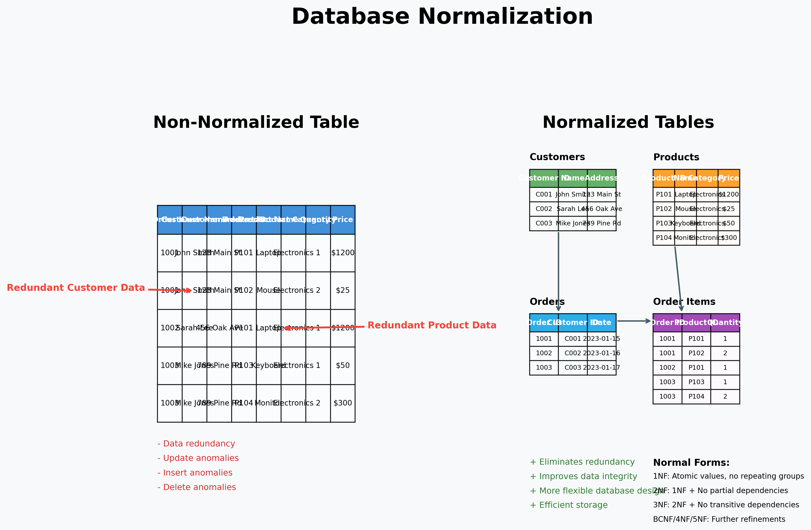

<style>table {font-size: 0.7em;}</style>

# Denormalizacija i Transakcije
## Raspodijeljene i nerelacijske baze podataka

Nikola Balić
nikola.balic@gmail.com
github.com/nkkko

---

## Uvod u Denormalizaciju i Transakcije

*   Upoznajmo dva važna koncepta u dizajnu i upravljanju bazama podataka: **denormalizaciju** i **transakcije**.
*   Iako se često razmatraju u kontekstu relacijskih baza podataka (RBP), principi i izazovi povezani s njima relevantni su i za nerelacijske baze podataka.
*   Razumijevanje ovih koncepata ključno je za izgradnju učinkovitih i pouzdanih sustava za pohranu i obradu podataka.
*   **Zajedno** ćemo istražiti kako ovi koncepti utječu na raspodjeljene i nerelacijske baze podataka.

---

## Zašto su Denormalizacija i Transakcije važne za NoSQL?

*   **Skalabilnost vs. Konzistentnost:** NoSQL sustavi moraju balansirati između horizontalne skalabilnosti i konzistentnosti podataka.
*   **Distribuirana priroda:** Raspodjeljene baze podataka čine transakcije složenijim izazovom.
*   **Izazovi velikih podataka:** Denormalizacija postaje ključna strategija za performanse u sustavima s velikim količinama podataka.

---

## Normalizacija - Temeljni Pristup

*   **Normalizacija** je proces organiziranja podataka u bazi podataka kako bi se smanjila redundancija i poboljšao integritet podataka.
*   Cilj je "usitnjavanje" (razbijanje) tablica na manje, međusobno povezane tablice.
*   Smanjenje anomalija prilikom unosa, ažuriranja i brisanja podataka.



---

## Što je normalizacija u praksi?

**Primjer nenormalizirane tablice:**

| OrderID | Customer | Email | Product | Price | Q | Total    |
|---------|--------------|---------------|-------------|--------------|----------|----------|
| 1       | Ana Horvat   | ana@mail.com  | Laptop      | 4999.99      | 1        | 4999.99  |
| 2       | Ana Horvat   | ana@mail.com  | Miš         | 199.99       | 2        | 399.98   |
| 3       | Ivan Kovač   | ivan@mail.com | Laptop      | 4999.99      | 1        | 4999.99  |

---
## Što je normalizacija u praksi?

**Problemi:**
* Redundancija podataka o kupcu (ime, email)
* Redundancija podataka o proizvodu (ime, cijena)
* Teško ažurirati podatke (npr. promjena cijene proizvoda)

---

## Normalne forme - Teorijski pregled

Normalizacija se provodi kroz nekoliko razina koje zovemo "normalne forme":

*   Svaka viša normalna forma gradi se na prethodnoj i dodatno poboljšava strukturu baze
*   Najčešće koristimo prve tri normalne forme u praksi
*   Postoje i više normalne forme za specifične situacije

---

## Normalne forme
**Prva normalna forma (1NF):**
* Podaci su organizirani u tablice
* Svaka ćelija sadrži samo jednu vrijednost (nema popisa ili skupova)
* Primjer: Umjesto popisa telefona u jednoj ćeliji, svaki telefon u zasebnom retku

---

## Normalne forme

**Druga normalna forma (2NF):**
* Mora zadovoljavati 1NF
* Svi atributi ovise o cijelom primarnom ključu, ne samo o dijelu ključa
* Uklanja situacije gdje neki podaci ovise samo o dijelu ključa

```
NARUDŽBA_DETALJI (ID_narudžbe, ID_proizvoda, Naziv_proizvoda, Cijena, Količina)
```
Problem: Naziv_proizvoda i Cijena ovise samo o ID_proizvoda, a ne o cijelom ključu. Prabaciti u 2NF: NARUDŽBA_STAVKE i PROIZVODI.

---

## Normalne forme - Više forme

**Treća normalna forma (3NF):**
* Mora zadovoljavati 2NF
* Atributi ne smiju ovisiti o drugim ne-ključnim atributima
* Uklanja indirektne ovisnosti između podataka

---

## Normalne forme - Više forme

Tablica koja nije u 3NF:
```
ZAPOSLENICI (ID_zaposlenika, Ime, ID_odjela, Naziv_odjela, Lokacija_odjela)
```

Problem: Naziv_odjela i Lokacija_odjela ovise o ID_odjela, a ne direktno o ID_zaposlenika. Ovo je tranzitivna ovisnost.

Rješenje - prebacivanje u 3NF:
```
ZAPOSLENICI (ID_zaposlenika, Ime, ID_odjela)
ODJELI (ID_odjela, Naziv_odjela, Lokacija_odjela)
```

---

## Normalne forme - Više forme

**Više normalne forme:**
* **Boyce-Codd NF (BCNF):** Stroža verzija 3NF; svaki determinant mora biti kandidat za ključ. Determinant je atribut (ili skup atributa) koji funkcionalno određuje neki drugi atribut. Prema BCNF, svaki determinant mora biti kandidat za ključ.
* **Četvrta (4NF)** i **Peta (5NF)** normalna forma: Rijetko se koriste u praksi, rješavaju složenije ovisnosti

---

## Primjer normalizacije - Od 1NF do 3NF

| OrderID | Customer | Email | Product | Category | Price | Q | Total    |
|---------|--------------|---------------|-------------|--------------|----------|----------|----------|
| 1       | Ana Horvat   | ana@mail.com  | Laptop      | Elektronika  | 4999.99      | 1        | 4999.99  |
| 2       | Ana Horvat   | ana@mail.com  | Miš         | Elektronika  | 199.99       | 2        | 399.98   |
| 3       | Ivan Kovač   | ivan@mail.com | Laptop      | Elektronika  | 4999.99      | 1        | 4999.99  |
| 4       | Ivan Kovač   | ivan@mail.com | Tipkovnica  | Elektronika  | 349.99       | 1        | 349.99   |
| 5       | Marija Jurić | marija@mail.com | Slušalice  | Elektronika  | 499.99       | 3        | 1499.97  |

- Redundancija podataka o kupcima (ime, email)
- Redundancija podataka o proizvodima (ime, kategorija, cijena)
- Izračunate vrijednosti (Total) koje mogu postati nekonzistentne
- Otežano ažuriranje (npr. promjena cijene proizvoda zahtijeva promjenu u više redaka)

---

### 2. Prva normalna forma (1NF)

Naša tablica već zadovoljava 1NF jer:
- Svaka ćelija sadrži samo jednu vrijednost
- Nema ponavljajućih grupa ili polja
- Svaki redak je jedinstven zahvaljujući OrderID-u

---

### 3. Druga normalna forma (2NF)

Prebacujemo u 2NF tako da razdvojimo podatke u nekoliko tablica kako bismo uklonili djelomične ovisnosti.

**Customers (Kupci)**
| CustomerID | Name | Email |
|---------|--------------|---------------|
| 1       | Ana Horvat   | ana@mail.com  |
| 2       | Ivan Kovač   | ivan@mail.com |
| 3       | Marija Jurić | marija@mail.com |

---

**Products (Proizvodi)**
| ProductID | Name | Category | Price |
|---------|--------------|---------------|-------------|
| 1       | Laptop      | Elektronika  | 4999.99      |
| 2       | Miš         | Elektronika  | 199.99       |
| 3       | Tipkovnica  | Elektronika  | 349.99       |
| 4       | Slušalice   | Elektronika  | 499.99       |

---

**Orders (Narudžbe)**
| OrderID | CustomerID | OrderDate |
|---------|------------|-----------|
| 1       | 1          | 2024-01-15|
| 2       | 1          | 2024-01-15|
| 3       | 2          | 2024-01-20|
| 4       | 2          | 2024-01-20|
| 5       | 3          | 2024-01-22|

---

**OrderItems (Stavke narudžbe)**
| OrderItemID | OrderID | ProductID | Quantity |
|-------------|---------|-----------|----------|
| 1           | 1       | 1         | 1        |
| 2           | 2       | 2         | 2        |
| 3           | 3       | 1         | 1        |
| 4           | 4       | 3         | 1        |
| 5           | 5       | 4         | 3        |

---

### 3. Druga normalna forma (2NF)

**Poboljšanja u 2NF:**
- Uklonjena redundancija podataka o kupcima
- Uklonjena redundancija podataka o proizvodima
- Svaka tablica ima jasan primarni ključ
- Nema djelomičnih ovisnosti (npr. cijena proizvoda ovisi samo o ProductID, ne o OrderID)

---

### 4. Treća normalna forma (3NF)

Model je već skoro u 3NF, ali moramo provjeriti jesu li uklonjene tranzitivne ovisnosti.

U našem slučaju, kategorija proizvoda mogla bi biti izdvojena u zasebnu tablicu ako jedan proizvod može pripadati samo jednoj kategoriji, a ista kategorija može imati više proizvoda.

**Categories (Kategorije)**
| CategoryID | CategoryName |
|------------|--------------|
| 1          | Elektronika  |
| 2          | Knjige       |
| 3          | Odjeća       |

---

**Products (Proizvodi) - revidirano za 3NF**
| ProductID | Name | CategoryID | Price |
|---------|--------------|---------------|-------------|
| 1       | Laptop      | 1             | 4999.99      |
| 2       | Miš         | 1             | 199.99       |
| 3       | Tipkovnica  | 1             | 349.99       |
| 4       | Slušalice   | 1             | 499.99       |

**Poboljšanja u 3NF:**
- Uklonjena tranzitivna ovisnost (naziv kategorije ovisi o CategoryID, a ne direktno o ProductID)
- Lakše održavanje kategorija (npr. promjena imena kategorije na jednom mjestu)
- Lakše dodavanje novih kategorija

---

### 5. Završni normalizirani model

Naš model sada sadrži 5 tablica:
- Customers (kupci)
- Categories (kategorije)
- Products (proizvodi)
- Orders (narudžbe)
- OrderItems (stavke narudžbe)

Svaka tablica ima jasno definiran primarni ključ i strane ključeve za povezivanje s drugim tablicama, i zadovoljava pravila 3NF.

---

## Primjer Normaliziranog Modela

**Relacijski model normaliziran do 3NF:**
- Svaka tablica ima jasno definiran primarni ključ
- Nema redundantnih podataka
- Nema djelomičnih ni tranzitivnih ovisnosti
- Podaci se pohranjuju na jednom mjestu i povezuju preko stranih ključeva

**Napomena:** Ovo je osnova za stvaranje sheme u relacijskoj bazi podataka, ali za stvarne sustave treba razmotriti i performanse, što može dovesti do kontrolirane denormalizacije.

---

## Prednosti Normalizacije

*   **Smanjena redundancija podataka:** Podaci se pohranjuju samo na jednom mjestu, čime se štedi prostor za pohranu.
*   **Poboljšan integritet podataka:** Lakše je održavati dosljednost podataka jer se promjene trebaju izvršiti samo na jednom mjestu.
*   **Lakše održavanje baze podataka:** Struktura baze podataka je jasnija i logičnija.
*   **Zaštita od anomalija:** Sprječava anomalije unosa, ažuriranja i brisanja koje mogu dovesti do nedosljednosti podataka.

---

## Nedostaci Normalizacije

*   **Fragmentacija podataka:** Podaci potrebni za jedan upit mogu biti raspršeni u više tablica.
*   **Složeniji upiti:** Za dohvat relevantnih informacija često su potrebni složeni JOIN upiti.
*   **Potencijalno lošije performanse za složene upite:** Veliki broj JOIN operacija može usporiti dohvat podataka.


---

## Primjer složenog JOIN upita u SQL-u

```sql
SELECT o.order_id, c.name AS customer_name, p.name AS product_name,
       oi.quantity, p.price, (oi.quantity * p.price) AS line_total
FROM Orders o
JOIN Customers c ON o.customer_id = c.customer_id
JOIN OrderItems oi ON o.order_id = oi.order_id
JOIN Products p ON oi.product_id = p.product_id
WHERE o.order_date BETWEEN '2024-01-01' AND '2024-03-31'
ORDER BY o.order_date DESC;
```

* 4 tablice povezane JOIN operacijama. Svaki JOIN zahtijeva usporedbe i spajanje podataka
* S povećanjem količine podataka, performanse mogu značajno opasti

---

## Normalizacija i Performanse - Praktična razmatranja

**Izazovi normalizacije s velikim količinama podataka:**

* **10,000 narudžbi × 5 stavki po narudžbi × 1,000 kupaca × 500 proizvoda**
* JOIN operacije postaju skupe
* Može dovesti do kašnjenja u stvarnom vremenu

---

## Normalizacija i Performanse - Praktična razmatranja

**Uobičajeni pristupi poboljšanju performansi:**
* Indeksi na stranim ključevima
* Materijalizirani pogledi (materialized views)
* Query cache
* **Denormalizacija** - optimizacija strukture podataka za specifične upite

---

## Denormalizacija - Optimizacija Performansi

*   **Denormalizacija** je namjerno dodavanje redundancije podataka u normaliziranu bazu podataka.
*   Cilj je poboljšati performanse dohvaćanja podataka žrtvujući neke prednosti normalizacije.
*   Denormalizacija se provodi na **već normaliziranim podacima** kao strategija optimizacije.
*   To je **svjesna** odluka, a ne slučajno loš dizajn!

---

## Denormalizacija - Ključna ideja

**Normalizirani model:**
* Svaki podatak pohranjen točno jednom
* Za dohvat povezanih podataka potrebno je spajanje tablica
* Ažuriranja su jednostavna, ali upiti mogu biti složeni

**Denormalizirani model:**
* Redundantna pohrana nekih podataka
* Smanjuje ili eliminira potrebu za spajanjem tablica
* Brži dohvat podataka, ali složenija ažuriranja

---

## Usporedba SQL upita: Normalizirani vs. Denormalizirani model

**Normalizirani model:**
```sql
SELECT o.order_id, c.name, c.phone, p.name, p.price, oi.quantity
FROM Orders o
JOIN Customers c ON o.customer_id = c.customer_id
JOIN OrderItems oi ON o.order_id = oi.order_id
JOIN Products p ON oi.product_id = p.product_id
WHERE o.order_id = 12345;
```

---

**Denormalizirani model:**
```sql
SELECT o.order_id, o.customer_name, o.customer_phone,
       oi.product_name, oi.product_price, oi.quantity
FROM Orders_D o
JOIN OrderItems_D oi ON o.order_id = oi.order_id
WHERE o.order_id = 12345;
```

**Opažanje:** Eliminacija 2 JOIN operacije u denormaliziranom modelu!

---

## Razlozi za Denormalizaciju - Kada i zašto?

*   **Povećanje performansi upita:** Smanjuje potrebu za složenim JOIN upitima.
*   **Veliki broj tablica i velika količina podataka:** U takvim sustavima, JOIN operacije mogu postati skupe.
*   **Brži pristup podacima za specifične poslovne zahtjeve:** Optimizacija za često korištene kombinacije podataka.
*   **Analitički sustavi:** Sustavi gdje je čitanje podataka mnogo češće od pisanja.
*   **Stvarno-vremenski odgovori:** Kada je brzina dohvata podataka kritična.

---

## Praktični primjer: e-trgovina

**Scenario:** Online trgovina s milijunima proizvoda i korisnika
**Izazov:** Brzo prikazivanje stranice proizvoda s:
- Detaljima proizvoda
- Informacijama o prodavaču
- Recenzijama korisnika
- Preporukama povezanih proizvoda

**Problem:** Za prikaz stranice proizvoda potrebno je 3-4 JOIN upita!

---

## e-shop: Denormalizirani pristup MongoDB

```json
{
  "_id": "PROD12345",
  "name": "Smartphone XYZ",
  "price": 3999.99,
  "description": "Najnoviji model...",
  "category": "Elektronika",
  "seller": {
    "id": "SELL789",
    "name": "TechShop",
    "rating": 4.8,
    "response_time": "2h"
  },
  "reviews": [
    {
      "user_id": "USER456",
      "user_name": "Marko",
      "rating": 5,
      "comment": "Odličan proizvod!"
    }
  ],
  "related_products": ["PROD789", "PROD456"]
}
```

**Prednost:** Svi podaci dostupni u jednom upitu!

---

## e-trgovina: Testiranje performansi

**Testni scenarij:** Dohvat stranice proizvoda s 10 recenzija

| Model | Vrijeme (ms) | Broj upita | Upiti/sec pod opterećenjem |
|-------|--------------|------------|----------------------------|
| Normalizirani | 120 | 4 | 800 |
| Denormalizirani | 30 | 1 | 3000 |

**Zaključak:** Denormalizirani model je:
- 4x brži za pojedinačni zahtjev
- Podržava skoro 4x veće opterećenje
- Pojednostavljuje aplikacijski kod (eliminira spajanje podataka)

---

## Uobičajene strategije denormalizacije

1. **Dupliciranje podataka:** Pohrana istih podataka na više mjesta za brži pristup
2. **Predračunate vrijednosti:** Pohrana izračunatih vrijednosti umjesto računanja pri dohvatu
3. **Agregacija i sažimanje:** Pohrana brojača, suma i drugih agregiranih vrijednosti
4. **Ugradnja povezanih podataka:** Pohrana povezanih podataka unutar glavnog entiteta
5. **Pohrana povijesnih podataka:** Čuvanje snimke podataka u trenutku stvaranja zapisa

---

## Primjer: Predračunate vrijednosti i agregacija

**Normalizirani pristup (izračun pri dohvatu):**
```sql
SELECT p.product_id, p.name,
       AVG(r.rating) as avg_rating,
       COUNT(r.review_id) as review_count
FROM Products p
LEFT JOIN Reviews r ON p.product_id = r.product_id
WHERE p.product_id = 12345
GROUP BY p.product_id, p.name;
```

---

## Primjer: Predračunate vrijednosti i agregacija

**Denormalizirani pristup (pohranjeni izračuni):**
```sql
SELECT product_id, name, avg_rating, review_count
FROM Products_Denormalized
WHERE product_id = 12345;
```

---

## Primjer: Denormalizacija za analitiku - Vremenski podaci

**Scenario:** Analiza prodaje po vremenskim razdobljima

**Normalizirani pristup:**
```sql
SELECT YEAR(o.order_date) as year,
       MONTH(o.order_date) as month,
       SUM(oi.quantity * p.price) as revenue
FROM Orders o
JOIN OrderItems oi ON o.order_id = oi.order_id
JOIN Products p ON oi.product_id = p.product_id
GROUP BY YEAR(o.order_date), MONTH(o.order_date);
```

---

## Primjer: Denormalizacija za analitiku - Vremenski podaci

**Denormalizirani pristup:**
```sql
SELECT year, month, SUM(revenue) as total_revenue
FROM Sales_Summary
GROUP BY year, month;
```

---

## Posljedice Denormalizacije

*   **Povećana redundancija podataka:** Isti podaci se pohranjuju na više mjesta.
*   **"Skupa" ažuriranja i unosi:** Promjene podataka moraju se propagirati na sva mjesta gdje se ti podaci nalaze.
*   **Potencijalne anomalije podataka:** Ako se ažuriranja ne provedu dosljedno, može doći do nekonzistentnosti podataka.
*   **Smanjena pouzdanost podataka:** Teže je garantirati točnost podataka.
*   **Povećana kompleksnost održavanja:** Zahtijeva dodatno kodiranje za održavanje konzistentnosti podataka.

---

## Mogući izazovi i problemi denormalizacije

**Scenario:** Promjena imena prodavača koja se mora ažurirati u svim proizvodima tog prodavača

**U normaliziranom vs. denormaliziranom  modelu:**
```sql
UPDATE Sellers SET name = 'Novi Naziv' WHERE seller_id = 123;
-- Jedna promjena na jednom mjestu
```

```sql
UPDATE Sellers SET name = 'Novi Naziv' WHERE seller_id = 123;
UPDATE Products SET seller_name = 'Novi Naziv' WHERE seller_id = 123;
UPDATE OrderItems SET seller_name = 'Novi Naziv' WHERE seller_id = 123;
-- Višestruke promjene na različitim mjestima
```

**Rizik:** Ako neki od ovih upita ne uspije, podaci postaju nekonzistentni!

---

## Tehnike održavanja konzistentnosti u denormaliziranim sustavima

1. **Transakcije:** Sve povezane promjene izvršavaju se kao jedna atomska operacija
2. **Trigger-i:** Automatizirane procedure koje se aktiviraju pri promjenama podataka
3. **Batch ažuriranja:** Periodičko osvježavanje denormaliziranih podataka
4. **Event sourcing:** Bilježenje svih promjena kao niza događaja
5. **Eventual consistency:** Prihvaćanje privremene nekonzistentnosti koja će se eventualno riješiti

---

## Kada razmotriti denormalizaciju - Pitanja za odluku

*   **Koliko često se podaci čitaju u odnosu na pisanje?** Denormalizacija je bolja za sustave s većom učestalošću čitanja.
*   **Koliko je važna brzina dohvata podataka?** Ako je latencija kritična, denormalizacija može biti presudna.
*   **Koliko je važna apsolutna konzistentnost podataka?** Ako se može tolerirati privremena nekonzistentnost, denormalizacija je prikladnija.
*   **Koja je veličina i kompleksnost podataka?** Veći skupovi podataka i kompleksni upiti više profitiraju od denormalizacije.
*   **Koji su tehnički resursi dostupni?** Denormalizacija može smanjiti potrebu za skupim hardverom.

---

## Kad je denormalizacija PREPORUČENA

*   **Analitički sustavi (OLAP):** Gdje su upiti kompleksni, ali ažuriranja rijetka
*   **Data warehousing:** Skladišta podataka optimizirana za analizu i izvještavanje
*   **Read-heavy aplikacije:** Društvene mreže, e-trgovine, portali s vijestima
*   **Brzi odgovori u stvarnom vremenu:** Tražilice, sustavi preporuka
*   **Masivni skupovi podataka:** Gdje JOIN operacije postaju neizvedive

---

## Kad je denormalizacija UPITNA

*   **Transakcijski sustavi (OLTP):** Visoka učestalost unosa i ažuriranja podataka
*   **Financijski sustavi:** Gdje su točnost i konzistentnost ključni za svaku transakciju
*   **Sustavi s kompleksnim odnosima između podataka** koji se često mijenjaju
*   **Sustavi s ograničenim prostorom za pohranu** gdje redundancija može biti problem
*   **Aplikacije s nepredvidivim obrascima upita** gdje je teško odrediti optimizacije

---

## Denormalizacija i NoSQL - Prirodna simbioza

*   **Fleksibilne sheme** NoSQL baza prirodno podržavaju denormalizaciju
*   **Horizontalna skalabilnost** NoSQL sustava olakšava upravljanje redundantnim podacima
*   **Dokumentne baze** posebno podržavaju ugradnju povezanih podataka (embedding)
*   **Distribuirana priroda** NoSQL baza čini JOIN operacije problematičnima, stoga denormalizacija često postaje nužnost
*   **Eventual consistency** model u mnogim NoSQL bazama podržava pristup denormalizaciji

---

## Dokumentne baze i ugradnja (MongoDB)

**Normalizirani pristup (reference):**
```javascript
// Kolekcija 'authors'
{
  _id: "auth1",
  name: "Ana Jurić",
  bio: "Poznata spisateljica..."
}

// Kolekcija 'books'
{
  _id: "book1",
  title: "Moj roman",
  author_id: "auth1",  // Referenca
  year: 2023
}
```

---

**Denormalizirani pristup (ugradnja):**
```javascript
// Kolekcija 'books'
{
  _id: "book1",
  title: "Moj roman",
  author: {  // Ugrađeni dokument
    name: "Ana Jurić",
    bio: "Poznata spisateljica..."
  },
  year: 2023
}
```

---

## Ključ-vrijednost i denormalizacija (Redis)

**Zahtjev:** Dohvati sve proizvode određene kategorije s ocjenama

**Normalizirani pristup:**
```
GET product:1001  // → {"name": "Laptop", "category": "electronics"}
GET product:1002  // → {"name": "Smartphone", "category": "electronics"}
GET ratings:1001  // → 4.5
GET ratings:1002  // → 4.2
```

---

**Denormalizirani pristup:**
```
GET category:electronics  // → [
                         //     {"id": 1001, "name": "Laptop", "rating": 4.5},
                         //     {"id": 1002, "name": "Smartphone", "rating": 4.2}
                         //   ]
```

**Rezultat:** Jedan upit umjesto nekoliko upita

---

## Stupčane baze i denormalizacija (Cassandra)

**Optimizacija za brzo čitanje specifičnih upita:**

```
CREATE TABLE products_by_category (
  category text,
  product_id uuid,
  name text,
  price decimal,
  description text,
  PRIMARY KEY (category, product_id)
);

CREATE TABLE products_by_price (
  category text,
  price_range text,
  product_id uuid,
  name text,
  price decimal,
  rating float,
  PRIMARY KEY ((category, price_range), price, product_id)
);
```

**Isti podaci duplicirani u više tablica, svaka optimizirana za specifičan upit**

---

## Graf baze i denormalizacija (Neo4j)

**Normalizirani pristup:**
```cypher
MATCH (u:User {id: 123})-[:FOLLOWS]->(friend:User)-[:POSTED]->(p:Post)
RETURN p.content, friend.name
```

**S denormaliziranim svojstvima:**
```cypher
MATCH (u:User {id: 123})-[f:FOLLOWS]->(friend:User)-[:POSTED]->(p:Post)
RETURN p.content, f.friend_name  // f.friend_name je duplicirano svojstvo
```

**Denormalizacija u graf bazama često uključuje dupliciranje svojstava na vezama i čvorovima radi optimizacije upita**

---

## Transakcije - Uvod

*   **Transakcija** je niz operacija koje se tretiraju kao jedna nedjeljiva logička cjelina.
*   Princip "sve ili ništa": ili se sve operacije u transakciji uspješno izvrše (**COMMIT**), ili se sve ponište i baza se vraća u prethodno stanje (**ROLLBACK**).
*   Osiguravaju da baza podataka prelazi iz jednog konzistentnog stanja u drugo.
*   Posebno važne u denormaliziranim sustavima za održavanje konzistentnosti!

---

## Primjer transakcije: Transfer novca

**Operacije unutar transakcije:**
1. Provjeri ima li pošiljatelj dovoljno sredstava
2. Umanji stanje računa pošiljatelja
3. Povećaj stanje računa primatelja
4. Evidentiraj transakciju u log

---

**Bez transakcije, mogući problemi:**
- Što ako sustav padne nakon koraka 2, a prije koraka 3?
- Što ako drugi korisnik istovremeno pokušava povući novac?
- Što ako se dogodi pogreška u koraku 3?

**Transakcije osiguravaju integritet sustava u takvim scenarijima!**

---

## ACID Svojstva Transakcija

*   **Atomicity (Atomičnost):** Operacije unutar transakcije su nedjeljive. Ako jedna operacija ne uspije, transakcija se poništava.
*   **Consistency (Konzistentnost):** Transakcija mora dovesti bazu podataka iz jednog valjanog stanja u drugo valjano stanje, poštujući sva definirana pravila i ograničenja.
*   **Isolation (Izoliranost):** Istovremene transakcije ne bi smjele ometati jedna drugu. Rezultat istovremenog izvršavanja više transakcija mora biti isti kao da su se izvršavale serijski.
*   **Durability (Trajnost):** Nakon što se transakcija uspješno završi (commit), promjene podataka su trajne i preživjet će eventualne sistemske kvarove.

---

## Atomičnost - "Sve ili ništa"

**Primjer:** Prebacivanje novca s jednog računa na drugi
* Ili će se izvršiti i terećenje i uplata (uspjeh)
* Ili neće doći do nikakve promjene (neuspjeh)
* Nikad se neće dogoditi da se novac samo skine ili samo uplati

---

## Konzistentnost - "Očuvanje pravila"

**Primjer:** Ograničenje da ukupna količina novca u sustavu ostaje konstantna
* Prije transakcije: račun A = 1000€, račun B = 500€, ukupno 1500€
* Transakcija: prebaci 200€ s A na B
* Nakon transakcije: račun A = 800€, račun B = 700€, ukupno 1500€
* Sva definirana ograničenja baze (constraints) ostaju zadovoljena

---

## Izoliranost - "Neovisno izvršavanje"

**Primjer:** Dvije istovremene transakcije nad istim računima
* Transakcija 1: Prebaci 200€ s A na B
* Transakcija 2: Dodaj 5% kamate na račun A
* Rezultat mora biti isti kao da su se izvršile jedna za drugom

---

## Trajnost - "Zapisano zauvijek"

**Primjer:** Nakon potvrde transakcije
* Ako sustav odmah nakon potvrde doživi kvar ili nestanak struje
* Kada se sustav vrati online, promjene su i dalje prisutne
* Obično se implementira pomoću transaction log-ova

---

## Operacije unutar Transakcije - Tipičan tijek

```sql
-- Početak transakcije
BEGIN TRANSACTION;

-- Izvršavanje operacija
UPDATE Accounts SET balance = balance - 200 WHERE account_id = 'A';
UPDATE Accounts SET balance = balance + 200 WHERE account_id = 'B';

-- Provjera uvjeta (opcionalno)
IF (SELECT balance FROM Accounts WHERE account_id = 'A') < 0 THEN
    -- Poništenje transakcije ako je stanje negativno
    ROLLBACK TRANSACTION;
ELSE
    -- Potvrda transakcije ako je sve u redu
    COMMIT TRANSACTION;
END IF;
```

---

## Razine izolacije transakcija

1. **Read Uncommitted:** Najniža razina - transakcija može vidjeti nepotvrđene promjene drugih transakcija (dirty reads)
2. **Read Committed:** Transakcija vidi samo potvrđene promjene drugih transakcija
3. **Repeatable Read:** Osigurava da ponovljena čitanja tijekom transakcije daju iste rezultate
4. **Serializable:** Najviša razina - transakcije se izvršavaju kao da su serijske

---

## Problemi konkurentnosti transakcija

1. **Dirty Read:** Čitanje nepotvrđenih promjena druge transakcije
2. **Non-Repeatable Read:** Dva čitanja istog podatka u jednoj transakciji daju različite rezultate
3. **Phantom Read:** Transakcija dohvaća različit skup redaka pri ponovljenom upitu
4. **Lost Update:** Dvije transakcije ažuriraju isti podatak i jedna poništava promjene druge

---

## Razine izolacije i problemi konkurentnosti

| Razina izolacije   | Dirty Read | Non-Repeatable Read | Phantom Read |
|--------------------|------------|---------------------|--------------|
| Read Uncommitted   | Moguć      | Moguć               | Moguć        |
| Read Committed     | Spriječen  | Moguć               | Moguć        |
| Repeatable Read    | Spriječen  | Spriječen           | Moguć        |
| Serializable       | Spriječen  | Spriječen           | Spriječen    |

**Kompromis:** Viša razina izolacije = bolja konzistentnost, ali niže performanse

---

## Vrste transakcija: Lokalne vs. Distribuirane

**Lokalne transakcije:**
* Odvijaju se unutar jedne instance baze podataka
* Jednostavnija implementacija i izvršavanje
* Brže i manje resursa

**Distribuirane transakcije:**
* Uključuju više neovisnih baza podataka ili sustava
* Zahtijevaju kompleksnije mehanizme koordinacije
* Potreban protokol za osiguranje ACID svojstava na više čvorova

---

## Distribuirane transakcije - Dvofazni commit

**Phase 1: Prepare**
1. Koordinator pita sve sudionike jesu li spremni za commit
2. Svaki sudionik izvršava transakciju do točke gdje je spreman za commit
3. Sudionici odgovaraju "spremni" ili "ne mogu"

---

**Phase 2: Commit/Abort**
1. Ako su SVI sudionici odgovorili "spremni", koordinator šalje "commit"
2. Ako je BILO KOJI sudionik odgovorio "ne mogu", koordinator šalje "abort"
3. Sudionici izvršavaju konačnu commit ili rollback operaciju

---

## Distribuirane transakcije - Primjer dvofaznog commita

**Scenario:** Online kupovina koja uključuje:
1. Sustav narudžbi
2. Sustav plaćanja
3. Sustav zaliha

---

## Eventualna konzistentnost (Eventual Consistency)

*   **Koncept:** Sustav će **u konačnici** postati konzistentan nakon što prestanu dolaziti novi unosi
*   **Propagacija promjena:** Promjene se eventualno propagiraju do svih čvorova u distribuiranom sustavu
*   **Kompromis:** Visoka dostupnost i skalabilnost nauštrb trenutne konzistentnosti
*   **Primjer:** Ažuriranje profila na društvenoj mreži - promjene mogu biti vidljive različitim korisnicima u različito vrijeme

---

## Transakcije u MongoDB - Dokument atomičnost

**Atomičnost na razini dokumenta:**
* Operacije na pojedinačnom dokumentu su atomične
* Ažuriranje više polja unutar jednog dokumenta je atomično

```javascript
// Atomično ažuriranje više polja u jednom dokumentu
db.accounts.updateOne(
  { account_id: "A" },
  { $set: { balance: 800 },
    $push: { transactions: { type: "debit", amount: 200, date: new Date() } }
)
```

**Ograničenje:** Ne garantira atomičnost između više dokumenata bez dodatnih mehanizama!

---

## Transakcije u Neo4j - ACID podrška

**Neo4j je rijedak primjer NoSQL baze s punom ACID podrškom:**

```cypher
BEGIN
// Provjeri stanje računa
MATCH (a:Account {account_id: 'A'})
WHERE a.balance >= 200
WITH a
// Izvrši transfer
MATCH (a:Account {account_id: 'A'})
SET a.balance = a.balance - 200
MATCH (b:Account {account_id: 'B'})
SET b.balance = b.balance + 200
// Dodaj transakcijsku vezu
CREATE (a)-[:TRANSFERRED {amount: 200, date: datetime()}]->(b)
COMMIT
```

---

## Globalno atomične transakcije

**Izazov:** Kako osigurati atomičnost kada podaci postoje na više distribuiranih NoSQL čvorova?

1. **Saga Pattern:** Razbijanje velike transakcije na manje, lokalne transakcije s kompenzacijskim akcijama
2. **Koordinirani protokoli:** Poput dvofaznog commit protokola (iako rijetko u NoSQL svijetu)
3. **Event Sourcing:** Bilježenje svih promjena kao niza događaja umjesto direktnog ažuriranja stanja
4. **Compensation-Based Transactions:** Izvršavanje "poništavajućih" akcija u slučaju greške

---

## Saga Pattern - Primjer

**Scenario:** Proces rezervacije putovanja koji uključuje:
1. Booking leta
2. Rezervaciju hotela
3. Najam automobila

**Implementacija Sage:**
* Svaki korak je lokalna transakcija
* Za svaki korak definira se kompenzacijska akcija
* U slučaju greške, izvršavaju se kompenzacijske akcije

---

## Event Sourcing i CQRS

**Event Sourcing:**
* Pohrana svih promjena kao niza događaja
* Trenutno stanje izračunava se primjenom svih događaja
* Omogućava točnu rekonstrukciju stanja u bilo kojoj točki vremena

**CQRS (Command Query Responsibility Segregation):**
* Odvajanje operacija čitanja i pisanja
* Različiti modeli za čitanje i pisanje podataka
* Često se koristi zajedno s Event Sourcing

---

## Interakcija Denormalizacije i Transakcija

*   Denormalizacija **značajno komplicira** održavanje transakcijskog integriteta
*   Potreba za ažuriranjem redundantnih podataka na više mjesta povećava **složenost transakcija**
*   Veće, denormalizirane tablice mogu dovesti do **duljih trajanja transakcija** i **povećanog zaključavanja**
*   U NoSQL bazama, kombinacija denormalizacije i ograničene transakcijske podrške stvara **dodatne izazove**

---

## Održavanje konzistentnosti u NoSQL bazama

1. **Strategije za specifične slučajeve upotrebe:**
   * Embedding (ugradnja) vs. referenciranje
   * Odabir primjerene granularnosti podataka

2. **Administrativne strategije:**
   * Periodička batch ažuriranja
   * Repair procesi koji otkrivaju i ispravljaju nekonzistentnosti

3. **Arhitekturalne strategije:**
   * Event-driven arhitekture
   * Message queues za asinkronu propagaciju promjena

---

## Studija slučaja: Twitter - Pohrana i dohvat tweetova

**Izazov:** Brzi dohvat timeline-a koji sadrži tweetove od svih praćenih korisnika

**Naivni pristup (normalizirani):**
1. Dohvati popis praćenih korisnika
2. Za svakog korisnika dohvati nedavne tweetove
3. Spoji i sortiraj sve dohvaćene tweetove

---

**Denormalizirani pristup (Twitter's solution):**
1. Kada korisnik A objavi tweet, kopija se sprema u timeline svakog pratitelja
2. Dohvat timeline-a je jednostavno čitanje već pripremljenih podataka

**Tradeoff:** Brzo čitanje, ali potencijalno sporo pisanje ako korisnik ima milijune pratitelja

---

## Studija slučaja: E-commerce - Inventar i naručivanje

**Izazov:** Održavanje točnog stanja zaliha tijekom procesa naručivanja

**Tradicionalni pristup (strogi ACID):**
1. Zaključavanje zapisa proizvoda tijekom čitavog procesa naručivanja
2. Odbijanje narudžbe ako nema dovoljno zaliha

---

**NoSQL pristup (optimistički):**
1. Provjera dostupnosti proizvoda bez zaključavanja
2. Umanjenje zaliha pri dovršetku narudžbe s provjerom verzije
3. U slučaju konflikta (netko je u međuvremenu kupio proizvod), prilagodba narudžbe ili obavijest korisniku

---

## Zaključak: Balansiranje denormalizacije i transakcija

*   **Normalizacija** je temeljni pristup za organizaciju podataka s ciljem smanjenja redundancije i poboljšanja integriteta.
*   **Denormalizacija** je strategija optimizacije performansi koja uključuje namjerno dodavanje redundancije.
*   **Transakcije** su ključni mehanizam za očuvanje integriteta podataka.
*   **NoSQL baze** nude različite kompromise između konzistentnosti i dostupnosti.
*   **Praktična rješenja** često kombiniraju više pristupa za optimalne rezultate.

---

## Pitanja za Razmišljanje

*   U kojim scenarijima bi prednosti denormalizacije prevagnule nad nedostacima?
*   Kako osiguravate konzistentnost podataka u denormaliziranoj bazi podataka s visokim prometom ažuriranja?
*   Koje su implikacije različitih razina izolacije transakcija na performanse i integritet podataka?
*   Kako arhitektura distribuiranih baza podataka utječe na implementaciju i performanse transakcija?
*   Je li moguće postići pravu ACID kompatibilnost u potpuno distribuiranom NoSQL sustavu?

---

## Daljnje Istraživanje

*   Detaljnije proučite različite normalne forme (1NF, 2NF, 3NF, itd.).
*   Istražite različite strategije denormalizacije i njihove specifične primjene.
*   Upoznajte se s različitim modelima konzistentnosti u distribuiranim sustavima.
*   Analizirajte transakcijsku podršku u popularnim NoSQL bazama podataka (npr., MongoDB, Cassandra).
*   Istražite nove pristupe poput NewSQL baza podataka koje pokušavaju kombinirati skalabilnost NoSQL-a s ACID jamstvima.

---

## Završne misli

* Razumijevanje denormalizacije i transakcija je **ključno** za dizajn učinkovitih sustava baza podataka
* Ne postoji **jedinstveno rješenje** - odabir strategije ovisi o specifičnim zahtjevima vašeg sustava
* **Balansiranje** između performansi, skalabilnosti i konzistentnosti ostaje glavni izazov u dizajnu baza podataka
* Moderni sustavi često koriste **hibridni pristup** kombinirajući prednosti različitih strategija
* **Konstantno učenje** je neophodno u ovom brzo razvijajućem području

---

## Ključne poruke

1. **Denormalizacija** je **svjesna odluka** za poboljšanje performansi, ne slučajan loš dizajn.
2. **Transakcije** su ključni mehanizam za očuvanje integriteta podataka.
3. **NoSQL baze** nude različite kompromise između konzistentnosti i dostupnosti.
4. **Razumijevanje specifičnih zahtjeva** vašeg sustava je ključno za odabir prave strategije.
5. **Praktična rješenja** često kombiniraju više pristupa za optimalne rezultate.