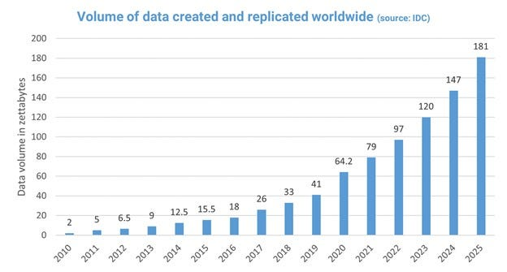

<style>table {font-size: 0.7em;}</style>

# DuckDB
### Moderna analitička SQL baza podataka

Nikola Balić
nikola.balic@gmail.com
github.com/nkkko

---

## Što je DuckDB?

- Moderna analitička SQL baza podataka
- Optimizirana za OLAP (Online Analytical Processing) radna opterećenja
- **Ugrađena** (embedded) baza podataka - slično SQLite, ali za analitiku
- Dizajnirana za brzu analizu velikih skupova podataka
- Open-source projekt (MIT licenca)
- Podržava standardni SQL s analitičkim proširenjima

---

## Ključne karakteristike DuckDB-a

- **Ugrađena (embedded) arhitektura**
  - Radi unutar procesa aplikacije (bez klijent-server arhitekture)
  - Nema potrebe za posebnom instalacijom ili konfiguracijom servera

---

- **Optimiziran za analitiku**
  - Stupčano (column-oriented) skladištenje podataka
  - Vektorizirano izvršavanje upita
  - Paralelizacija na više jezgri

- **SQL kompatibilnost** s analitičkim proširenjima
  - Podržava standardni SQL, lako prijenosniji upiti

---

## DuckDB u kontekstu baza podataka

|                    | DuckDB                    | Relacijske DB (PostgreSQL) | NoSQL DB (MongoDB)       |
|--------------------|---------------------------|-----------------------------|--------------------------|
| **Model**          | Relacijski (SQL)          | Relacijski (SQL)            | Dokument                 |
| **Optimiziran za** | Analitiku (OLAP)          | Transakcije (OLTP)          | Skalabilnost, fleksibilnost |
| **Arhitektura**    | Ugrađena (embedded)       | Klijent-server              | Klijent-server           |
| **Skladištenje**   | Stupčano                  | Redčano                     | Dokument (BSON)          |
| **Instalacija**    | Biblioteka (nula konfiguracije) | Server (konfiguracija)    | Server (konfiguracija)   |
| **Skaliranje**     | Vertikalno                | Vertikalno                  | Horizontalno             |

---

## Zašto koristiti DuckDB?

- **Jednostavnost korištenja**
  - Nula konfiguracije - "samo radi"
  - Biblioteka koja se uključuje u aplikaciju
  - Potrebno samo jedno izvršavanje upita za pripremu

- **Analitičke performanse**
  - Brže od relacijskih baza za kompleksne analitičke upite
  - Učinkovito rukovanje velikim volumenima podataka
  - Optimizirano za čitanje, ne pisanje

---

- **Integracija s različitim izvorima podataka**
  - Direktno čitanje iz CSV, Parquet, JSON, Excel...
  - Integracija s pandas DataFrame, Arrow, SQL bazama

---

## Usporedba s drugim bazama podataka



**DuckDB vs SQLite**
- SQLite: optimiziran za OLTP (transakcije)
- DuckDB: optimiziran za OLAP (analitiku)

**DuckDB vs PostgreSQL**
- PostgreSQL: klijent-server, svestrana
- DuckDB: ugrađena, fokusirana na analitiku

**DuckDB vs BigQuery/Redshift**
- Cloud warehouses: ogromni distribuirani sustavi
- DuckDB: lokalna analitika, manje skalabilna ali jednostavnija

---

## Ključni slučajevi korištenja

1. **Analiza podataka i istraživanje**
   - Brza eksploracija velikih CSV/Parquet datoteka
   - Interaktivna analiza u Jupyter notebook-ovima

2. **ETL procesi**
   - Transformacija i priprema podataka za učitavanje

---

3. **Ugrađena analitika u aplikacijama**
   - Mobilne i desktop aplikacije s analitičkim mogućnostima
   - Serverless funkcije s intenzivnom analizom podataka

4. **Testiranje i razvoj**
   - Lokalni razvoj prije prelaska na cloud sustave
   - Simulacija kompleksnih analitičkih upita bez infrastrukture

---

## Instalacija i povezivanje

**Python**
```python
pip install duckdb

import duckdb
con = duckdb.connect('my_database.db')  # ili :memory: za privremenu bazu
result = con.execute("SELECT 42 AS answer").fetchall()
print(result)  # [(42,)]
```

---

## Integracija s pandas (Python)

```python
import pandas as pd
import duckdb

# Kreiranje DataFrame-a
df = pd.DataFrame({
    'A': [1, 2, 3, 4],
    'B': [10, 20, 30, 40]
})

# Direktno izvršavanje SQL upita nad DataFrame-om
result = duckdb.query_df(
    df,
    "SELECT A, B, A*B AS C FROM df WHERE A > 2"
).df()

print(result)
```

---

## Učitavanje podataka iz različitih izvora

```python
import duckdb

con = duckdb.connect(':memory:')

# CSV datoteka
con.execute("CREATE TABLE csv_data AS SELECT * FROM read_csv_auto('data.csv')")

# Parquet datoteka
con.execute("CREATE TABLE parquet_data AS SELECT * FROM read_parquet('data.parquet')")

# JSON datoteka
con.execute("CREATE TABLE json_data AS SELECT * FROM read_json_auto('data.json')")

# Direktno čitanje
results = con.execute("SELECT * FROM 'data.csv'").fetchdf()
```

---

## Napredne analitičke mogućnosti

**Vremenski nizovi**
```sql
-- Analiza vremenskih serija
SELECT
    date_trunc('month', datum) AS mjesec,
    SUM(prodaja) AS ukupna_prodaja
FROM prodaje
GROUP BY mjesec
ORDER BY mjesec;
```

**Kompleksne agregacije**
```sql
-- Korelacija između varijabli
SELECT corr(cijena, kolicina) FROM prodaje;

-- Percentili
SELECT
    approx_quantile(cijena, 0.5) AS medijan,
    approx_quantile(cijena, 0.9) AS percentil_90
FROM prodaje;
```

---

## Particioniranje i paralelizam

```python
import duckdb

# Korištenje svih dostupnih CPU jezgri
con = duckdb.connect(':memory:')
con.execute("PRAGMA threads=4")  # ili 0 za automatski odabir

# Paralelno izvođenje upita
results = con.execute("""
    SELECT customer_region, SUM(sales)
    FROM sales
    GROUP BY customer_region
""").fetchall()
```

DuckDB automatski paralelizira izvršavanje upita ako je moguće, koristeći dostupne CPU jezgre.

---

## Optimizacija performansi

**Indeksiranje**
- DuckDB uglavnom ne koristi indekse kao tradicionalne baze
- Stupčano pohranjeni podaci s implicitnim indeksiranjem
- Pruža filtriranje zonskih mapa (zone maps)

**Napredna optimizacija upita**
- Automatska optimizacija plana izvršavanja
- Vektorizirano izvršavanje za brzu obradu
- Push-down predikata u filtre podataka

---

## Integracija s drugim sustavima

**Arrow i Pandas integracija**
```python
import duckdb
import pyarrow as pa
import pandas as pd

# Pandas -> DuckDB
df = pd.DataFrame({'a': [1, 2, 3]})
con.execute("CREATE TABLE tbl AS SELECT * FROM df")

# Arrow -> DuckDB
arrow_table = pa.Table.from_pandas(df)
con.execute("CREATE TABLE arrow_tbl AS SELECT * FROM arrow_table")
```

**SQL baze podataka**
```python
import duckdb

# Povezivanje na SQLite bazu
con.execute("ATTACH 'sqlite_db.db' AS sqlite_db (TYPE SQLITE)")
results = con.execute("SELECT * FROM sqlite_db.some_table").fetchdf()
```

---

## Praktični primjer: Analiza podataka prodaje

```python
import duckdb
import pandas as pd

# Povezivanje na DuckDB
con = duckdb.connect(':memory:')

# Učitavanje podataka
con.execute("CREATE TABLE prodaje AS SELECT * FROM read_csv_auto('prodaje.csv')")

# Složeni analitički upit
rezultat = con.execute("""
    WITH mjesecna_prodaja AS (
        SELECT
            strftime(datum, '%Y-%m') AS mjesec,
            regija,
            SUM(iznos) AS ukupno
        FROM prodaje
        GROUP BY mjesec, regija
    )
    SELECT
        regija,
        AVG(ukupno) AS prosjecna_mjesecna_prodaja,
        MAX(ukupno) AS max_mjesecna_prodaja,
        MIN(ukupno) AS min_mjesecna_prodaja
    FROM mjesecna_prodaja
    GROUP BY regija
    ORDER BY prosjecna_mjesecna_prodaja DESC
""").fetchdf()

print(rezultat)
```

---

## Budućnost DuckDB-a

- **Stalni razvoj i optimizacije**
  - Sve bolje performanse i više mogućnosti

- **Integracija s više izvora podataka**
  - Proširenje na više formata i sustava

- **Podrška za distribuirano izvršavanje**
  - Rad na Motherduck - distribuiranoj verziji DuckDB-a

- **Primjene u AI i data science**
  - Optimiziran za pripremu podataka za ML modele
  - Integracija s modernim AI ekosustavima

---

## Zaključak

**DuckDB popunjava važnu nišu u ekosustavu baza podataka:**

- Jednostavna, ali moćna relacijska baza podataka za analitiku
- Izvrsne performanse bez kompleksne infrastrukture
- Most između tradicionalnih SQL i modernih analitičkih sustava
- Idealan alat za data science, ETL i lokalne analitičke zadatke

**Dok relacijske baze dominiraju u OLTP, a NoSQL u distribuiranim sustavima, DuckDB otvara pristupačan put do napredne analitike.**

---

## Praktične vježbe

1. **Instalirati DuckDB i učitati CSV datoteku**
2. **Napisati složeni analitički upit s više agregacijskih funkcija**
3. **Usporediti performanse istog upita u SQLite i DuckDB**
4. **Integrirati DuckDB s pandas DataFrame-om**

---

## Pitanja?

### Sada je vrijeme za vaša pitanja!

Kontakt informacije:
Nikola Balić
nikola.balic@gmail.com
github.com/nkkko