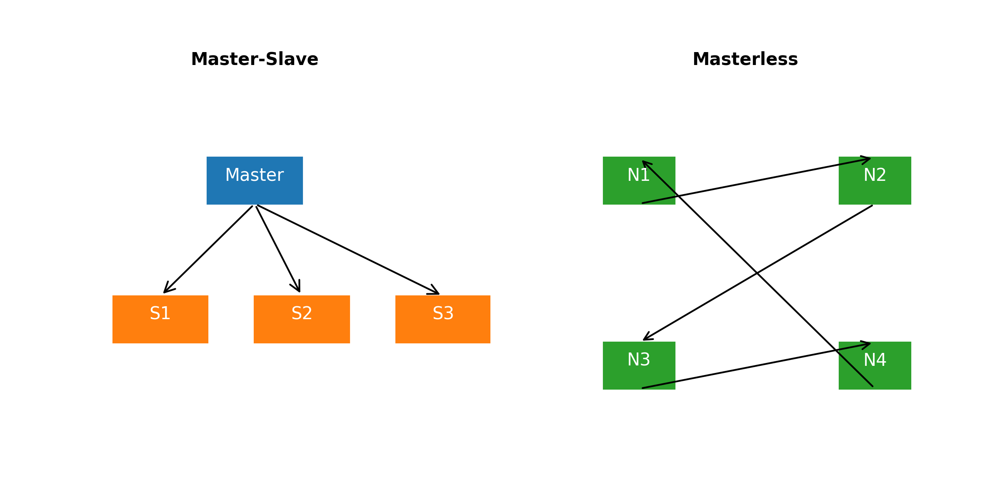
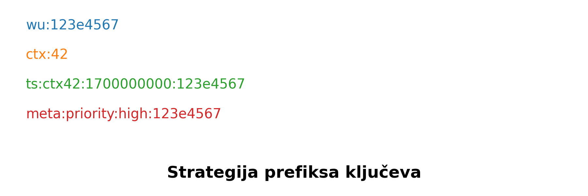
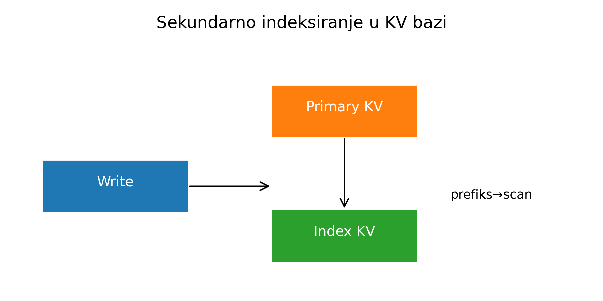

# Ključ-vrijednost baze podataka
### Temelj Brzih i Skalabilnih Aplikacija

### Akademska godina 2024/2025
Nikola Balić
nikola.balic@gmail.com
github.com/nkkko

---
## Uvod

- **Ključ-vrijednost (Key-Value) DB** najjednostavnija je skupina NoSQL baza podataka.
-   Svaki zapis = **Jedinstveni Ključ** ➜ **Pripadajuća Vrijednost**.
- Vrijednost može biti *string, broj, binarni podatak* … nema strogo definirane sheme.
- Fokus na **jednostavnosti, brzini i fleksibilnosti** u pohrani i dohvaćanju.
- Primjer analogije: tablica s dva stupca `ID` (= key) i `NAME` (= value).

---
## Kada (ne) koristiti K-V baze

| ✔️ Pogodno za...                     | ❌ Manje pogodno za...                |
| :----------------------------------- | :----------------------------------- |
| ⚡ Brza čitanja/pisanja (npr. **Cache**) | 🔗 Složene upite i **JOIN**-ove       |
| 👤 Korisničke **sesije**, profili     | 🏛️ Strogu **konzistenciju** (banke)   |
| 📊 Nestrukturirani ili *BLOB* podaci | 📈 Dubinsku **analitiku** na podacima |
| 📈 **Horizontalno skaliranje** (lako) |  ACID **transakcije** (rijetko)    |
| 🎯 Dohvati po **točnom ključu**        | 🔍 **Pretraga po vrijednosti** (bez indeksa) |

---
## Prednosti

1.  **🚀 Performanse:** Super brze operacije (često <1ms). Minimalna obrada.
    *   _Primjer: Redis može >1M operacija/sec!_
2.  **📈 Skalabilnost:** Lako dodavanje novih servera (horizontalno).
3.  **🧩 Fleksibilnost:** Nema rigidne sheme, spremi što god trebaš.
4.  **💰 Trošak:** Puno moćnih *open-source* rješenja (Redis, RocksDB...).

---
## Nedostaci

1.  **❓ Ograničeni Upiti:** Teško pretraživati po *vrijednosti* bez dodatnih indeksa. Zaboravi SQL `WHERE` klauzule na vrijednostima.
2.  **💾 Veličina Vrijednosti:** Često ograničena (npr. par KB/MB po zapisu).
3.  **🤔 Konzistentnost:** Često *eventualna* konzistentnost (CAP: Dostupnost > Konzistentnost). Nije idealno ako podaci *moraju* biti odmah točni svugdje.
4.  **⛓️ Bez Transakcija:** Većina nema klasične ACID transakcije preko više ključeva.

---
## Mogućnosti i hibridni pristupi

🔑 K-V baze **sjaje** u kombinaciji s drugim bazama!

*   **Caching Sloj:** Najčešći podaci u brzom K-V (Redis), ostatak u RDBMS/drugom NoSQL-u.
*   **"Polyglot Persistence":** Pravi alat za pravi posao. Npr. korisnički podaci u Document DB, sesije u K-V, logovi u TimeSeries DB.
*   **Izbjegavaj "Data Silo":** Razmišljaj o cijeloj arhitekturi.

> **Ključno:** Odaberi bazu prema **potrebama dijela aplikacije**, ne jednu za sve!

---

| Rang | Sustav             | Tip Pohrane               | Ključna Značajka/Upotreba        |
| :--- | :----------------- | :------------------------ | :------------------------------- |
| 1    |  **Redis**  | In-memory (+disk)         | ⚡ Brzina, Cache, Pub/Sub       |
| 2    |  **Amazon DynamoDB** | Cloud, on-disk            | ☁️ AWS, Skalabilnost, Upravljan |
| 3    |  **Dragonfly** | In-memory                 | 🚀 Redis kompatibilan, performanse |
| 4    |  **Riak**   | Masterless, on-disk       | 🛡️ Visoka dostupnost (legacy?)   |
| 5    |  **RocksDB** | **Embedded**, on-disk       | 🏗️ Engine za druge baze (MyRocks)|
| 6    |  **Workers KV** | Edge-distributed          | 🌍 Globalna distribucija (CF)    |

---
## Primjeri proizvodnih sustava

*   **Redis:** Cache slojevi (web stranice, API-ji), Session store (pamti tko si logiran), Rate limiting, Pub/Sub (chatovi, notifikacije).
    *   *Twitter, GitHub, Stack Overflow...*
*   **DynamoDB:** Backend za mnoge AWS servise, IoT platforme, Gaming (leaderboards).
    *   *Amazon.com (košarica!), Lyft, Duolingo...*
*   **RocksDB:** "Ispod haube" mnogih sustava (Facebook, CockroachDB, TiKV).
*   **Cloudflare Workers KV:** Brze globalne postavke, A/B testiranje, konfiguracija na rubu mreže.

> Arhitektura i primjena: https://architecturenotes.co/redis/

---
## Od niza do K-V baze

1.  **Obični Niz (Array):** Indeks = broj (0, 1, 2...). Elementi istog tipa.
    `["jabuka", "kruška", "šljiva"]`
2.  **Asocijativni Niz (Map/Dict):** Indeks = bilo koji ključ. Vrijednosti razne.
    `{"ime": "Ana", "godine": 30, "grad": "Zagreb"}` (u memoriji!)
3.  **K-V Baza:** Kao asocijativni niz, ali...
    *   **💾 Trajna** (na disku/cloudu)
    *   **☁️ Distribuirana** (na više servera)
    *   **📈 Skalabilna**

---

```python
# Python dict (mapa u memoriji)
cache = {}
cache["user:123:session"] = "{'token': 'xyz', 'expires': ...}"
cache["product:456:price"] = 99.99
```

---
## Pohrana podataka

*   **In-Memory (RAM):** 🚀 Ekstremno brzo! (npr. Redis, Dragonfly)
    *   Ograničen kapacitet (koliko RAM-a imaš).
    *   Trajnost? Opcionalno (snapshot, AOF log). Rizik gubitka podataka!
*   **On-Disk (SSD/HDD):** 💾 Veći kapacitet, trajno po prirodi. (npr. DynamoDB, RocksDB)
    *   Sporije od RAM-a (mreža + disk I/O).
*   **Kombinirano:** RAM za brzinu, Disk za trajnost/veći kapacitet.

---
## Osnovne operacije API-ja

| Operacija     | Primjer (Redis)     | Opis                               | Ikona |
| :------------ | :------------------ | :--------------------------------- | :---- |
| `PUT` / `SET` | `SET user:123 Ana`  | Spremi ili ažuriraj vrijednost     | 💾    |
| `GET`         | `GET user:123`      | Dohvati vrijednost za ključ        | 🔍    |
| `DELETE`      | `DEL user:123`      | Ukloni zapis (ključ i vrijednost) | 🗑️    |

> **Naprednije:** Mnoge nude `INCR` (povećaj broj), `EXPIRE` (postavi vijek trajanja), `SCAN` (iteriraj kroz ključeve - oprezno!).

---

## Brzina vs. Kapacitet: In-Memory vs. On-Disk

| Karakteristika | In-Memory (npr. Redis) | On-Disk (npr. RocksDB) |
| :------------- | :--------------------- | :--------------------- |
| **Latencija**  | 📉 **Mikro**sekunde (µs) | 🐌 **Mili**sekunde (ms)  |
| **Kapacitet**  | Ograničen **RAM**-om (GB) | Ograničen **Diskom** (TB+) |
| **Trajnost**   | Opcionalna (snapshot/AOF)| ✅ Ugrađena (trajna)     |
| **Cijena/GB**  | 💰💰 Skuplje             | 💰 Jeftinije             |
| **Tipična Uloga**| Cache, Sesije, Brojači | Glavna pohrana, Engine   |

---
## Upravljanje memorijom (evikcija)

Kod **In-Memory** baza, memorija je ograničena! Što kad se napuni?

*   **Eviction Policy** (Pravilo Izbacivanja): Odlučuje koji ključ izbaciti.
    *   **LRU (Least Recently Used):** Izbaci najmanje korišteni ključ. (Najčešći)
    *   **LFU (Least Frequently Used):** Izbaci najmanje *često* korišteni ključ.
    *   **Random:** Izbaci nasumični ključ.
    *   **TTL (Time To Live):** Izbaci ključeve kojima je istekao `EXPIRE`.
*   **Konfiguracija:** Npr. `maxmemory-policy` u Redis-u.

---
## Skalabilnost – replikacija

**Cilj:** Povećati dostupnost (ako jedan server padne) i performanse čitanja.

### Model 1: Master-Slave (Leader-Follower)

*   Jedan **Master** prima sva **pisanja**.
*   **Slave(ovi)** kopiraju podatke s Mastera i služe za **čitanja**.
*   **Prednosti:** Jednostavno, odlično za *read-heavy* sustave.
*   **Mana:** Master je *Single Point of Failure* (treba Sentinel/automatski failover).

---

### Masterless (peer-to-peer)

*   **Svi čvorovi su ravnopravni** (nema Mastera).
*   Podaci se repliciraju na **N** susjednih čvorova (često koristeći *Consistent Hashing Ring*).
*   Pisanje/čitanje može ići na **bilo koji** čvor.
*   **Prednosti:** Bolja dostupnost (nema SPOF), bolje za *write-heavy*.
*   **Mana:** Složenije upravljanje konzistencijom (konflikti zapisa).
*   *Primjeri: Riak (stariji), DynamoDB stil.*

---



---
## Kako Raspodijeliti Ključeve? Hashiranje! 🔢

**Problem:** Kako znati na koji server (particiju/čvor) spremiti `user:123`?

**Rješenje:** **Hash Funkcija**
1.  Uzmi ključ (`user:123`).
2.  Primijeni hash funkciju (npr. SHA-1, MurmurHash) -> dobiješ broj (hash).
3.  `particija = hash(ključ) mod N` (gdje je N broj particija/servera).

---

**Napredno: Consistent Hashing**
*   Problem s `mod N`: Ako dodaš/ukloniš server (promijeniš N), *većina* ključeva mora promijeniti lokaciju! 😱
*   **Consistent Hashing:** Minimizira premještanje ključeva kad se broj servera mijenja. Ključevi se mapiraju na "krug", serveri također. Ključ ide na prvi server "desno" na krugu.

---
## Kako Nazivati Ključeve? Pametno! ✨

Dobar dizajn ključeva je **KRITIČAN**!

**Konvencija (primjer):** `<entity>:<id>[:<attribute>]`

*   `user:123` (JSON s podacima o korisniku 123)
*   `user:123:name` (samo ime korisnika 123 - ako atomarno trebaš)
*   `product:456:details`
*   `order:2024-05-15:items`
*   `session:xyz789abc`

---

**Zašto je važno?**
*   **Organizacija:** Lakše za razumijevanje i debugiranje.
*   **Sprječavanje Kolizija:** `user:123` i `order:123` su različiti.
*   **Upiti:** Omogućava dohvaćanje povezanih podataka (npr. `SCAN` s uzorkom `user:123:*`).
*   **Sharding:** Pomaže u grupiranju povezanih podataka na iste particije (ako hash ovisi o dijelu ključa).

---



---
## Pretraživanje po vrijednosti

1.  **Aplikacijska Logika:** Dohvati *sve* (ili puno) podataka (`SCAN` - opasno!) i filtriraj u **svom kodu**. 🐢 (Sporo i neučinkovito za velike skupove).
2.  **Sekundarni Indeksi (Ručno):** Sam kreiraš dodatne K-V parove koji služe kao indeks.
    *   Npr., za traženje korisnika po emailu:
        *   Glavni podatak: `user:123 -> {"name": "Ana", "email": "ana@example.com"}`
        *   Indeks: `email:ana@example.com -> user:123`
    *   Moraš **ažurirati oba** pri promjeni! Kompleksno za održavanje.

---

3.  **Integrirani Indeksi (Ako Baza Podržava):** Neke K-V baze imaju dodatke za ovo (npr. **Redis Search**). Kreiraju indekse za tebe.
    *   Puno **lakše**, ali troši više **memorije/resursa**.

---



---
## Ključni Pojmovi

| Pojam             | Opis                                                                   | Povezano sa...         |
| :---------------- | :--------------------------------------------------------------------- | :--------------------- |
| **Namespace**     | Logička grupa K-V parova (kao folder). Izbjegava konflikte imena.        | Dizajn Ključeva        |
| **Bucket / Table**| Terminologija nekih baza (npr. Riak, DynamoDB) za namespace.           | Terminologija          |
| **Partition / Shard** | Podskup podataka na jednom čvoru/serveru.                             | Hashiranje, Skalabilnost|
| **Replication**   | Kopiranje podataka na više čvorova radi dostupnosti/performansi.         | Skalabilnost           |
| **Consistency Model** | Pravila o tome kada će svi čvorovi vidjeti najnoviji zapis (Strong, **Eventual**...). | Replikacija, Nedostaci |

---
| Pojam             | Opis                                                                   | Povezano sa...         |
| :---------------- | :--------------------------------------------------------------------- | :--------------------- |
| **Eviction**      | Proces izbacivanja podataka (obično iz memorije) kad ponestane prostora. | In-Memory Baze       |
| **Serialization** | Proces pretvaranja objekta (npr. JSON) u niz bajtova za spremanje kao vrijednost. | Fleksibilnost          |

---
## Studija slučaja – Praćenje pošiljaka

*   **Aplikacija:** Praćenje pošiljaka (~10k korisnika).
*   **Problem:** Treba brzo prikazati status zadnjih pošiljaka na početnom ekranu. 90% operacija su **čitanja**.
*   **Rješenje:** **Redis** kao K-V store.
    *   **Ključ:** Broj pošiljke (npr. `track:ACC12345`).
    *   **Vrijednost:** JSON objekt sa statusom, lokacijom, povijesti.
    *   **Prefiksi za organizaciju:** `user:<id>`, `track:<id>`, `alert:<id>`.

---

*   **Zašto K-V?**
    *   ⚡ **Brzina:** Trenutno učitavanje statusa po poznatom ključu (broju pošiljke).
    *   📈 **Skalabilnost:** Lako dodati Redis replike ako broj čitanja poraste.
    *   🧩 **Fleksibilnost:** JSON vrijednost lako prima nove atribute statusa.

---
## POnavljanje 1/3

1.  **K-V Baza vs. Mapa:** K-V baza je **trajna** (podaci prežive restart), **distribuirana** (na više servera) i **skalabilna**, dok je mapa u memoriji programa, privremena i ograničena resursima tog procesa.
2.  **Kada je K-V odličan:**
    *   **Caching:** Ubrzavanje dohvata često korištenih podataka.
    *   **Korisničke sesije:** Brzo spremanje i dohvaćanje podataka o logiranim korisnicima.
    *   (Ostali: Leaderboards, Rate Limiting, Konfiguracije...)

---
## POnavljanje 2/3
3.  **Consistent Hashing:** Minimizira broj ključeva koje treba premjestiti kada se doda ili ukloni server, za razliku od `mod N` gdje se većina ključeva mora remapirati, što uzrokuje veliki promet i nedostupnost.
4.  **Mana eventualne konzistentnosti:** Različiti klijenti mogu vidjeti **različite (stare) verzije podataka** u kratkom periodu nakon ažuriranja. Nije prikladno za operacije koje zahtijevaju trenutnu, globalnu točnost (npr. stanje bankovnog računa).

---

## Ponavljanje 2/2

5.  **Master-Slave:** Jedan server (Master) prima sva pisanja, dok ga drugi (Slaveovi) kopiraju i služe za čitanja. Rizik: Ako **Master padne**, pisanje staje (osim ako nema automatskog failovera - Sentinela).
6.  **Ručna pretraga po emailu:** Kreirati **dodatni K-V zapis** gdje je **ključ email**, a **vrijednost je ID korisnika** (npr. `email:ana@ex.com -> user:123`). Pri upitu po emailu, prvo pročitati ID iz ovog indeksa, pa onda dohvatiš `user:123`. **Održavanje je ključno!**
7.  **Eviction Policy:** Pravilo koje određuje koji će se podaci **izbaciti iz memorije** kada se ona napuni. Važna je jer sprječava pad baze zbog nedostatka memorije (OOM) i utječe na performanse (ako izbaci "krive" podatke).

---
## Zaključak

K-V Baze: **Jednostavne, Brze, Skalabilne** 🚀

*   Idealne za **specifične probleme**: cache, sesije, brzi dohvati po ID-u.
*   **Nisu** "one-size-fits-all" rješenje (ograničeni upiti, eventualna konzistentnost).
*   Prava snaga dolazi iz **kombiniranja** s drugim bazama podataka.
*   **Dizajn ključeva** i razumijevanje **trade-offova** (brzina vs. konzistentnost vs. kapacitet) su ključni!

---

## Engram v3 – Studija slučaja 🧠🤖

*Real-time suradnja AI agenata uz nisku latenciju i trajnu pohranu*

---
## Zahtjevi sustava Engram v3

- **Vrlo niska latencija:** < 5 ms po operaciji (cilj: < 1 ms zapis, < 2 ms čitanje)
- **Trajnost stanja:** podaci moraju preživjeti restart (WAL)
- **Real-time fan-out:** promjene se odmah emitiraju svim agentima
- **Fleksibilni podaci:** "WorkUnit" može biti poruka, kod, rezultat alata…

**Pitanje:** Zašto standardna RDBMS ili čak mrežni K-V (poput Redis-a preko mreže) možda nisu dovoljno brzi?

---
## Zašto KV i zašto BeaverDB?

- **Performanse:** ugrađena (embedded) KV BP pisan u Go → nema mrežne latencije
- **Jednostavna distribucija:** bez vanjske ovisnosti, cross-compile friendly
- **Trajnost:** Write-Ahead Log + ACID transakcije
- **Shema-less:** raznovrsni entiteti serijalizirani kao JSON/Protobuf

---
## Organizacija podataka (prefiksi)

Kako organizirati različite tipove podataka u jednoj K-V bazi? **Prefiksi Ključeva!**

```go
const (
    prefWork  = "wu:"
    prefCtx   = "ctx:"
    prefLock  = "lock:"
    prefMeta  = "meta:"
)
// Primjeri:
// wu:<uuid>      -> []byte(WorkUnit)
// ctx:<id>       -> []byte(Context)
```

- **Ključ = Prefiks + ID**  → logičke "kolekcije" unutar jedne KV BP

---
## Sekundarno indeksiranje bez SQL-a

- **Vremenski indeks:** `ts:<ctx>:<unixns>:<wuID>` ➜ range scan po vremenu
- **Meta indeks:** `meta:<key>:<val>:<wuID>` ➜ filtriranje po oznakama
- **Tekst indeks:** `text:<word>:<wuID>` ➜ jednostavno pretraživanje riječi

→ Dizajn ključeva omogućuje složene upite koristeći samo `PrefixScan`.

---
## Optimizacije performansi

- Povećani *MemTable* i *ValueLog* buffersi
- `SyncWrites = false` + periodički `fsync` → brži upis uz prihvatljiv rizik
- Vlastiti LRU cache sloj iznad BeaverDB-a
- Periodične kompakcije & GC za čist i brz storage

---
## Lekcije iz Engram v3

1.  **Dizajn Ključa = Dizajn Upita:** Bez dobrih prefiksa i strukture ključa, nema efikasnog dohvaćanja bez full scan-a.
2.  **Embedded KV = Jednostavnost:** Nema mrežne latencije, lakši deployment, manje pokretnih dijelova. Idealno za performanse i samostalne aplikacije.
3.  **Tuning je OBAVEZAN:** Zadane postavke rijetko zadovoljavaju ekstremne performanse (<1ms). Razumijevanje parametara baze je ključno.

---

4.  **ACID + Brzina su Mogući:** Moderni embedded KV engine-i (kao BadgerDB/BeaverDB, RocksDB) nude oboje uz pažljiv dizajn.
5.  **KV NIJE Ograničenje:** Uz pametan dizajn ključeva i eventualno dodatne indekse, podržava i kompleksnije scenarije i real-time rad.
