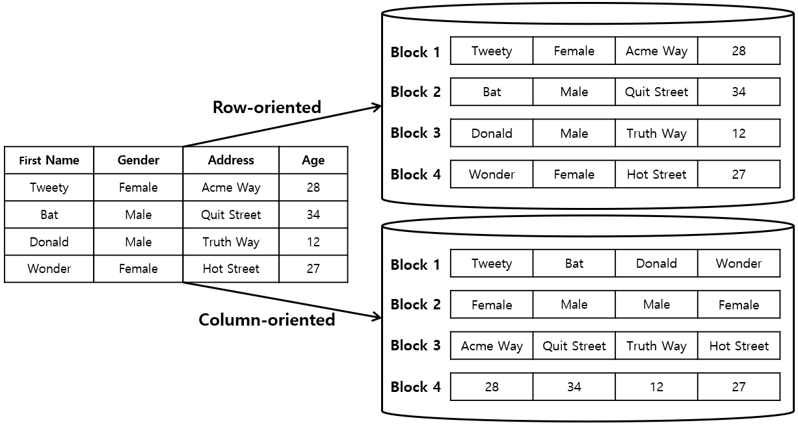
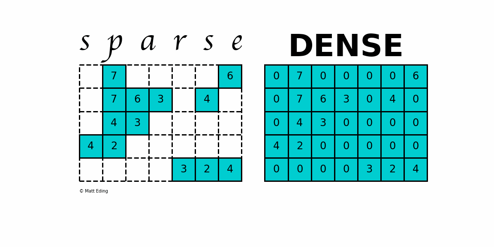

# Stučaste baze

### Akademska godina 2024/2025
Nikola Balić
nikola.balic@gmail.com
github.com/nkkko

---
## Problem: Društvena platforma u krizi

**Scenarij:** Radite na rastućoj društvenoj platformi s 10M+ korisnika
- **Padovi sustava:** Baza podataka se ruši tijekom vršnih sati
- **Spora izvedba:** Generiranje feedova traje 10+ sekundi
- **Problemi skaliranja:** Svaki novi server dodaje složenost
- **Problemi s troškovima:** Zahtjevi za pohranu rastu eksponencijalno

Kako biste redizajnirali ovaj sustav?

---
## Zašto tradicionalne baze podataka nisu dovoljne

**Zahtjevi vaše društvene platforme:**
- Potrebno je pohraniti: Korisničke profile, objave, komentare, lajkove, praćenja
- Potrebno je posluživati: Personalizirane feedove, obavijesti, analitiku
- Potrebno je upravljati: Nepredvidivim rastom, sezonskim skokovima prometa

---

**Problemi s RDBMS-om za ovaj slučaj:**
- JOIN operacije postaju preskupe
- Promjene sheme su teške kako se funkcionalnosti razvijaju
- Vertikalno skaliranje doseže fizička ograničenja
- Nemoguće je učinkovito particionirati podatke preko više servera

---
## Rješenja iz stvarnog svijeta

**Netflix:** Povijest gledanja i preporuke korisnika
- Migrirali s Oracle-a na Cassandra-u
- Sada obrađuju 3+ bilijuna podatkovnih točaka dnevno
- Napaja algoritme personalizacije za 200M+ pretplatnika

**Spotify:** Korisnički podaci o slušanju i upravljanje playlistama
- Koristi Cassandra-u za praćenje 100M+ aktivnih korisnika
- Pokreće funkcije otkrivanja sadržaja kroz 422M ukupnih pjesama

---

**Instagram:** Vremenske crte korisnika i metapodaci objava
- Cassandra obrađuje milijarde unosa vremenskih crta dnevno
- Omogućuje dostavu objava u gotovo stvarnom vremenu globalnoj publici

---
## Osnove Column-Family baza

**Temeljni koncept:** Podaci pohranjeni kao stupci unutar obitelji stupaca, adresirani prema ključu retka

```
┌─────────────────────────────────────────────┐
│ Ključ retka: "user_123"                     │
├─────────────────┬───────────────────────────┤
│ Obitelj stupaca:│ Obitelj stupaca:          │
│ profil          │ objave                    │
├─────────────────┼───────────────────────────┤
│ ime: "Ana"      │ 2023-01-01: "Prvi post"   │
│ email: "a@e.com"│ 2023-01-15: "Drugi post"  │
│ dob: "29"       │ 2023-02-01: "Treći post"  │
└─────────────────┴───────────────────────────┘
```

---
## Row vs. Column Oriented Storage


---
## Row vs. Column Oriented Storage

### Fundamentalna razlika

**Row-oriented:**
```
[id:1, name:"Ana", email:"ana@email.com", dept:"HR"]
[id:2, name:"Ivan", email:"ivan@email.com", dept:"IT"]
```

**Column-oriented:**
```
id:    [1, 2]
name:  ["Ana", "Ivan"]
email: ["ana@email.com", "ivan@email.com"]
dept:  ["HR", "IT"]
```
---



---
## Row-Oriented Storage

- **Pohranjuje redak po redak**
- **Optimizirano za:**
  - OLTP (Online Transaction Processing)
  - Često pisanje
  - Dohvat kompletnih zapisa

- **Prednosti:**
  - Učinkovit unos/ažuriranje zapisa
  - Jednostavno upravljanje transakcijama
  - Efikasno kod dohvaćanja cijelog retka

---
## Column-Oriented Storage

- **Pohranjuje stupac po stupac**
- **Optimizirano za:**
  - OLAP (Online Analytical Processing)
  - Analitiku
  - Agregacije (SUM, AVG, COUNT)

- **Prednosti:**
  - Bolja kompresija podataka
  - Učinkovitije čitanje podskupa stupaca
  - Brže analitičke operacije

---
**OLTP vs OLAP: Usporedba**

| Karakteristika | OLTP | OLAP |
|----------------|------|------|
| **Primarna svrha** | Svakodnevne transakcije | Poslovna analitika |
| **Optimizacija** | Pisanje i čitanje pojedinačnih zapisa | Složeni upiti nad velikim skupovima podataka |
| **Veličina podataka** | Manji broj zapisa po upitu | Velike količine podataka |
| **Struktura podataka** | Normalizirane tablice | Denormalizirani, višedimenzionalni modeli |
| **Ažuriranje** | Često (stvarno vrijeme) | Periodično (batch) |
| **Performanse** | Brze transakcije (ms) | Duži upiti (s ili min) |
| **Shema** | Stabilna | Dinamična |
| **Primjeri primjene** | transakcije, trgovina | Business Intelligence, predviđanje |
| **Preferirana pohrana** | Red-orijentirane BP | Stupac-orijentirane BP |

---
## Demonstracija SQL upita 1

### SELECT ime FROM emp WHERE ID_br=666

**Row-oriented execution:**
```
1. Učitaj prvi blok (redci 1001-1003)
2. Provjeri uvjet ID_br=666 za svaki redak
3. Učitaj drugi blok (redci 1004-1006)
4. Provjeri uvjet ID_br=666 za svaki redak
5. Kada se pronađe redak, vrati vrijednost 'ime'
```

**Column-oriented execution:**
```
1. Učitaj stupac ID_br
2. Pronađi pozicije gdje je ID_br=666
3. Učitaj samo te pozicije iz stupca 'ime'
```

---
## Demonstracija SQL upita 2 🤔

### SELECT SUM(placa) FROM emp

**Row-oriented execution:**
```
1. Učitaj sve blokove
2. Izvuci vrijednost plaće iz svakog retka
3. Izračunaj sumu
```

**Column-oriented execution:**
```
1. Učitaj samo stupac 'placa'
2. Izračunaj sumu
```

---
## Terminologija Column-Family baza

### Različiti nazivi, slični koncepti

- **Column Family Databases**
- **Wide Column Stores**
- **Column-oriented Databases**
- **Bigtable Clones**

**Konfuzija:** "Column-oriented" može se odnositi na:
1. Način fizičkog pohranjivanja podataka
2. Logički model višedimenzionalnih ključ-vrijednost parova

---
## Osnovna struktura

### Glavni koncepti

- **Sparse Matrix:** Samo popunjena polja su pohranjena
- **Multidimensional Map:** Organizacija kao višestruka mapa



---
## Ključne komponente

### Anatomija Column Family baze podataka

- **Keyspace:** Kontejner za column families (analog sheme)
- **Row Key:** Jedinstveni identifikator retka
- **Column Family:** Grupa povezanih stupaca
- **Column:** Najmanja jedinica pohrane (ime:vrijednost)
- **Timestamp:** Verzioniranje vrijednosti

---
## Row Key

- **Jedinstveni identifikator** za redak (npr. `user123`, `com.google.www`)
- **Analogno primarnom ključu** u relacijskoj bazi
- **Omogućuje:**
  - Brzo pronalaženje podataka (lookup)
  - Distribuciju podataka (sharding)
  - Sortiranje podataka za efikasne range scanove
- **Pohranjen leksikografski:** Ključno za grupiranje povezanih podataka i range scanove.
- **Veličina (Bigtable):** Proizvoljan string, tipično 10-100 bajtova, maksimalno do 64KB.

---
## Stupci: Struktura i Vrijednost

### Atomska jedinica podataka

**Struktura stupca (ćelije):**
- **Ime stupca (Column Qualifier):** Identifikator stupca unutar column family (proizvoljan string).
- **Vrijednost:** Niz bajtova (neinterpretirani podatak sa strane baze).

**Primjeri ćelija (logički prikaz):**
```
"name:Ana:1577836800"
"name:Ana Horvat:1609459200"  // novija verzija
```

---
## Vremenske Oznake (Timestamps)

- **Vremenska oznaka (Timestamp):** 64-bitni integer koji označava verziju podatka.
  - Može biti automatski dodijeljen od Bigtable-a (npr. mikrosekunde) ili postavljen od klijenta.
  - Verzije za istu ćeliju (redak, stupac) pohranjuju se opadajuće po vremenskoj oznaci (najnovija prva).
  - Kod čitanja, ako timestamp nije zadan, vraća se najnovija verzija.
  - Podržava automatski garbage collection starih verzija (npr. zadnjih N verzija ili unutar perioda).

---
## Atomarno čitanje i pisanje

- **Operacije na razini retka su atomarne** (eng. *atomic on a single row*)
- **Garantirano je da će se svi stupci u retku prilikom jedne operacije:**
  - Pročitati zajedno kao jedinica (ili nijedan)
  - Zapisati zajedno kao jedinica (ili nijedan)

- **Nema parcijalnih rezultata** unutar operacije na jednom retku.
- **Transakcijska ograničenja:** atomične op. samo na jednom retku. Ne podržava generalne transakcije preko više redaka ili tablica.

---
## Bigtable: Početak column-family DB

### Google's Revolucija

- **Objavljen 2006. godine**
- **Citiran rad:** "Bigtable: A Distributed Storage System for Structured Data"
- **Utjecaj:** Inspirirao mnoge open-source implementacije
- **Cilj:** Skaliranje do petabajta podataka
- **Dizajn:** Optimiziran za nisko-latentno, visoko-propusno okolinu

---
## Google Motivacija

### Zašto su razvili Bigtable?

- **Polustrukturirani podaci:**
  - Web indeksi (URL, sadržaj, meta)
  - Korisnički podaci (preference, pretraživanja)
  - Geografski podaci (lokacije, satelitske slike)

- **Zahtjevi:**
  - Milijarde URL-ova
  - Milijuni korisnika
  - Terabajtne zbirke

---
## Bigtable Model Podataka: Definicija

### Trodimenzionalna sortirana mapa

*   Bigtable model: **"rijatka (sparse), distribuirana, perzistentna višedimenzionalna sortirana mapa."**
    *   Indeksirana s: `(row:string, column:string, time:int64) → string`
    *   **"Sparse"**: Većina ćelija je prazna, ne zauzima prostor.
    *   **"Multidimensional"**: Dimenzije čine ključ retka, column family, kvalifikator stupca i timestamp.
    *   **Vrijednost:** Niz bajtova (neinterpretiran).

---
## Bigtable Model Podataka: Primjer Webtable

**Primjer: Bigtable Web tablica**
- **Row key:** "com.cnn.www" (obrnuti URL radi grupiranja po domeni)
- **Column family "contents:"**: Sadržaj stranice (verzija s vrem. oznakom dohvata).
- **Column family "anchor:"**: Linkovi koji upućuju na stranicu.
    - Kvalifikator: URL stranice koja linka (npr., `anchor:cnnsi.com`).
    - Vrijednost: Tekst sidra (anchor text).
- **Timestamp:** 64-bitni integer za verzioniranje.

---
## Bigtable: Kompakcije - Minor i Merging

1.  **Minor Compaction (Manja kompakcija):**
    - Kad memtable dosegne prag veličine, zamrzava se.
    - Kreira se novi memtable, a zamrznuti se konvertira u SSTable (Sorted Strings Table) i piše na GFS.
    - Svrha: Smanjuje memorijsku upotrebu i vrijeme oporavka.

2.  **Merging Compaction (Spajajuća kompakcija):**
    - Povremeno spaja nekoliko SSTable-ova (i memtable) u novi SSTable.
    - Svrha: Ograničava broj SSTable-ova za pregled pri čitanju.

---
## Bigtable: Kompakcije - Major

3.  **Major Compaction (Velika kompakcija):**
    - Spaja *sve* SSTable-ove tableta u jedan potpuno novi SSTable.
    - Ključno: Jedini proces koji **fizički uklanja obrisane podatke** (označene za brisanje ili stare verzije).
    - Oslobađa prostor na disku i osigurava da su logički obrisani podaci zaista i fizički uklonjeni.

---
## Optimizacije: Locality Groups i Kompresija

- **Locality Groups (unutar Column Families):**
  - Grupiranje više column families; svaka grupa čini zaseban SSTable.
  - Efikasnije čitanje ako se ne pristupa svim familijama zajedno.
  - Neke grupe mogu biti deklarirane da se drže u memoriji.

- **Kompresija:**
  - Korisnik specificira format po locality group.
  - Značajno smanjuje prostor za pohranu.
  - Često dvoprolazna kompresija (npr. Bentley-McIlroy + brzi algoritam).

---
## Bigtable Optimizacije: Caching i Bloom Filteri

- **Caching za čitanje (Višeslojni):**
  - *Scan Cache (viša razina):* Kešira (ključ, vrijednost) parove iz SSTable sučelja (za često čitane retke).
  - *Block Cache (niža razina):* Kešira SSTable blokove s GFS-a (za vremensku/prostornu lokalnost pristupa).

- **Bloom Filteri:**
  - Mogu se kreirati po SSTable-u.
  - Brza (probabilistička) provjera da li SSTable *možda* sadrži podatak za (redak, stupac), smanjujući nepotrebne disk pristupe.

---
## Bigtable Optimizacije: Commit Log i Nepromjenjivost SSTable-ova

- **Commit Log Implementacija:**
  - Jedan log po Tablet serveru (ne po tabletu) -> bolje performanse (group commit).
  - Tipično dvije log-pišuće niti (otpornost na GFS zastoje).

- **Nepromjenjivost SSTable-ova (Immutability):**
  - Jednom zapisan na GFS, SSTable se ne mijenja.
  - Pojednostavljuje: keširanje, konkurentnost (nema lockova za čitanje), dijeljenje tableta, garbage collection (brisanje starih SSTable-ova).

---
## Moderne Column-Family baze podataka

**Apache Cassandra:**
- Pokreće tisuće poduzeća (Netflix, Apple, Instagram)
- Decentralizirana arhitektura peer-to-peer (bez glavnog čvora)
- Elastična skalabilnost s linearnim povećanjem performansi
- CQL (Cassandra Query Language) - sučelje slično SQL-u

---

**ScyllaDB:**
- "Cassandra prepisana u C++" - do 10x bolje performanse
- Kompatibilna s Cassandra upravljačkim programima i CQL-om
- Smanjena operativna složenost sa samopodešavanjem
- Ključni korisnici: Discord, Starbucks, Samsung

**Amazon DynamoDB:**
- Potpuno upravljani NoSQL s funkcijama obitelji stupaca
- Automatsko skaliranje s konzistentnim performansama ispod 10 ms
- Koriste ga Capital One, Lyft, Airbnb

---

**DB Engines**


---
## Moderna integracija

**Integracija s Kubernetesom:**
- Cassandra i ScyllaDB operatori za k8s implementaciju
- StatefulSets za upravljanje Cassandra čvorovima
- Mogućnosti automatskog skaliranja na cloud platformama

**Mikroservisi i streaming događaja:**
- Change Data Capture (CDC) iz Cassandra/ScyllaDB u Kafka
- Obrasci event-sourcinga s column DB kao spremištem
- Materijalizirani pogledi iz streaming događaja

---
## Column baze i strojno učenje

**Analitika vremenskih serija:**
- Podaci za treniranje detekcije anomalija (CloudFlare, Uber)
- Spremište značajki za sustave preporuka (Spotify)
- Podaci senzora za prediktivno održavanje (GE, Siemens)

**ML pipelines u stvarnom vremenu:**
- Visoko propusni unos za streaming ML značajke
- Integracija sa Sparkom za batch treniranje
- Posluživanje s niskom latencijom za online zaključivanje

---
## Studija slučaja: Cloudflare

- 32M+ HTTP zahtjeva u sekundi
- Potreba za otkrivanjem obrazaca i anomalija u stvarnom vremenu, zahtijeva trenutnu i povijesnu analizu

**Column-Family rješenje:**
- ScyllaDB za analizu prometa u stvarnom vremenu
- Ključevi redaka dizajnirani za vremensko particioniranje
- Obitelji stupaca za različite obrasce prometa
- TTL za automatsko upravljanje životnim ciklusom podataka

---
## Studija slučaja: Discord

**Discord-ov izazov skalabilnosti:**
- 300M registriranih korisnika, 25+ milijardi poruka mjesečno, 19M aktivnih servera

**ScyllaDB implementacija:**
- Pohranjuje podatke o prisutnosti korisnika i poruke
- Real-time: indikatori tipkanja, status online
- Podržava i trenutni pristup i povijesno pretraživanje
- Prilagođena strategija shardinga za ravnomjernu distribuciju

---
## Kada NE koristiti Column-Family BP

### Ograničenja

1. **Kompleksne relacije** između podataka
2. **Česti multi-row upiti** bez pažljivog modeliranja
3. **Aplikacije s brojnim ad-hoc upitima**
4. **Potreba za strogim ACID transakcijama**
5. **Mali volumen podataka**

---
## Zaključak

### Prednosti i nedostaci

**Prednosti:**
- Skalabilnost do petabajta podataka
- Visoke performanse za analitičke upite
- Fleksibilna shema
- Efikasna pohrana velikih količina podataka

---

**Nedostaci:**
- Veća kompleksnost modeliranja
- Ograničena podrška za transactions
- Nije optimalna za sve tipove upita
- Zahtijeva pažljiv dizajn ključeva

---

# InfluxDB: Baza Podataka za Vremenske Serije

## Uvod u InfluxDB

- **Što je InfluxDB?** Vodeća open-source TSDB.
- **Namjena:** Optimizirana za podatke s vremenskim oznakama (telemetrija, senzori, logovi, metrike).

---

## InfluxDB Ekosustav: Od Tick Stack-a do Danas

- **Tick Stack (Originalno):**
  - **T**elegraf: Agent za prikupljanje metrika.
  - **I**nfluxDB (1.x, 2.x): Baza za pohranu.
  - **C**hronograf: Vizualizacija.
  - **K**apacitor: Obrada i alertiranje.
- **Evolucija:**
  - Chronograf često zamijenjen s Grafana/SuperSet.
  - Kapacitor u v3.0 zamijenjen ugrađenim Python VM & trigerima.

---

## Tehnološka Evolucija InfluxDB

- **InfluxDB 1.x & 2.x:** Napisane u Go, postavile temelje.
- **InfluxDB 3.0: Nova Generacija**
  - Značajan redizajn, **prepisana u Rust-u**.
  - Cilj: Bolje performanse, skalabilnost, efikasnost.

---

## Izazov: "Kriza Kardinalnosti"

- **Kardinalnost:** Broj jedinstvenih vremenskih serija (mjerenje + tagovi).
- **Problem:** Visoka kardinalnost drastično smanjuje performanse (unos, upiti).
  - Ograničavalo bogatstvo podataka (manje tagova).

---

## Rješenje: InfluxDB 3.0 Arhitektura

- **Cilj:** Rješavanje krize kardinalnosti, efikasna pohrana.
- **Arhitektura bazirana na Object Storage-u (npr. S3, MinIO):**
  - **Razdvajanje Compute & Storage resursa:**
    - Neovisno skaliranje, isplativija dugoročna pohrana.

---

## InfluxDB 3.0: SQL kao Standard

- **Napuštanje Flux-a:** Vlastiti jezik (InfluxDB 2.x), nije postigao široku primjenu.
- **Usvajanje SQL-a:**
  - Industrijski standard, lakša integracija, šira dostupnost alata i znanja.
  - Manja krivulja učenja.

---

## InfluxDB 3.0: FDAP Stack

- **Izgrađen na Apache open-source komponentama.**
- **FDAP Akronim:**
  - **F**light (Arrow Flight SQL): Efikasan RPC za SQL upite.
  - **D**ataFusion: Rust query engine (koristi Arrow).
  - **A**rrow (Apache Arrow): Brzi in-memory kolumnarni format.
  - **P**arquet (Apache Parquet): Kolumnarni format za object storage (kompatibilan s lakehouse-om).

---

## Apache Parquet: Kolumnarni Format za Pohranu

- **Optimiziran za analitiku:** Dizajniran za efikasnu pohranu i dohvat podataka za analitičke upite.
- **Kolumnarna pohrana:**
    - Podaci istog stupca pohranjuju se zajedno.
    - Bolja kompresija (slični podaci su skupa).
    - Efikasno čitanje samo potrebnih stupaca (smanjuje I/O).

---

- **Integracija s ekosustavom:**
    - Široko korišten u Hadoop, Spark, Presto, i modernim data lakehouse arhitekturama.
    - Ključan za InfluxDB 3.0 za pohranu na object storage-u i interoperabilnost.
- **Podržava kompleksne tipove podataka i shema evoluciju.**

---

## InfluxDB 3.0: Operativni Fokus

- **Biti najbolji u 3 domene:**
  1.  **Ingestija:** Brz unos ogromnih količina podataka, odmah dostupni.
  2.  **Organizacija:** Efikasno smještanje i indeksiranje (object storage, cache).
  3.  **Upiti:** Izuzetno brzi odgovori (sub-ms za operativne upite).

---

## InfluxDB u "Lakehouse" Svijetu

- **Nadopuna, ne zamjena** za DataBricks, Snowflake itd.
- **Integracija podataka:**
  - Laka integracija u lakehouse (Apache Iceberg nad Parquet).
  - "Zero ETL" ili minimalan ETL.
  - Analiza TS podataka s ostalim poslovnim podacima.

---

## Uloga InfluxDB-a u Modernim Sustavima

1.  **Operativni TSDB ("Oči i uši")**: Real-time monitoring, dashboarding.
2.  **Podrška za AI/ML modele**: Izvor TS podataka za treniranje (često u lakehouse-u).
3.  **Izvršavanje AI/ML inferencija**: Primjena modela na live podatke za real-time kontrolu.

---

## Slučajevi Korištenja: IoT i Industrijski IoT (IIoT)

- **Dominantan segment (60-70% poslovanja InfluxData).**
- **Primjene:** Senzori (industrija, pametni gradovi), telemetrija uređaja.
- **Primjer: Tesla Powerwalls**
  - ~1M jedinica šalje podatke u InfluxDB.
  - Omogućava trgovanje energijom (intervali od 4s).

---

## Slučajevi Korištenja: Monitoring, Alertiranje i Kontrola

- **Real-time Monitoring & Alertiranje:**
  - Nadzor IT sustava (serveri, mreže, aplikacije), API monitoring.
  - Proaktivno otkrivanje problema.
- **Sustavi za Kontrolu u Stvarnom Vremenu:**
  - Automatizacija procesa na temelju live podataka.

---

## Slučajevi Korištenja: Embedded Sustavi i Edge Computing

- **InfluxDB na rubu mreže (Edge):**
  - Mogućnost pokretanja na manjim uređajima (Raspberry Pi, gateway-i).
  - Prikupljanje i predobrada podataka bliže izvoru.
- **Telegraf:** Univerzalni kolektor, često kao embedded agent.

---

## InfluxDB: Snaga Open Source-a

- **Temelji u zajednici (MIT/Apache licence).**
- **Preko 1.3M dnevnih korisnika (OSS verzije).**
- **Prednosti:** Brza adopcija, feedback, doprinos zajednice, transparentnost.
