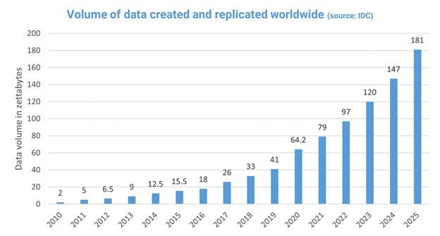
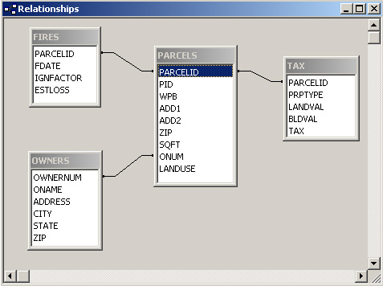
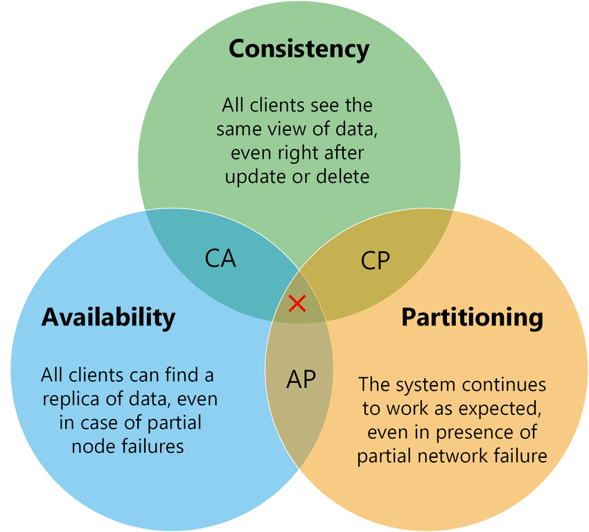
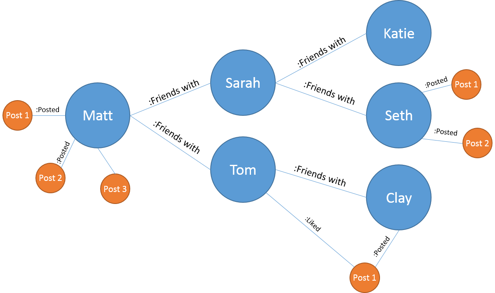

# Raspodijeljene i nerelacijske baze podataka

## Uvod u moderno upravljanje podacima


---
## Informacijsko doba - Podatak je ključ

- **Temelj informacijskog doba:** Podaci su postali najvažniji resurs u 21. stoljeću.
- **Pokretač promjena:** Podaci omogućuju inovacije u svim aspektima života i poslovanja.
- **Odlučivanje temeljeno na podacima:**  Umjesto intuicije, odluke se donose analizom podataka.


---
## Četvrta industrijska revolucija

- **Digitalizacija i podaci:** Četvrta industrijska revolucija je snažno povezana s digitalizacijom i eksponencijalnim rastom podataka.
- **Automatizacija i AI:** Podaci su gorivo za umjetnu inteligenciju i automatizaciju procesa.
- **Nove tehnologije:** Big Data, Cloud Computing, IoT, AI - sve su pogonjene podacima.


---
## Eksplozija količine podataka

- **Eksponencijalni rast:** Količina podataka se neprestano i ubrzano povećava.




---

## Računalna organizacija podataka - Baze podataka

- **Organizacija podataka:** Kako učinkovito organizirati i upravljati sve većom količinom podataka?
- **Baze podataka (BP):** Rješenje za strukturirano pohranjivanje i upravljanje podacima.
- **Učinkovit pristup:** BP omogućuju brz i siguran pristup podacima kada su potrebni.


---
## Relacijske baze podataka (RBP) - Klasik

- **Dominantan model:** RBP su desetljećima bile dominantan model za pohranu podataka.
- **Strukturirani podaci:** Idealne za podatke koji se mogu organizirati u tablice s redovima i stupcima.
- **SQL jezik:** Standardizirani jezik za manipulaciju i upite nad relacijskim bazama podataka.


---



---
```
Tablica: Kupci

| ID      | Ime      | Prezime    | Email               | Telefon        |
|---------|----------|------------|---------------------|----------------|
| 1       | Ana      | Horvat     | ana.h@email.hr      | 091-555-1234  |
| 2       | Marko    | Kovačević  | marko.k@mail.com    | 098-222-3333  |
| 3       | Ivana    | Jurić      | ivana.j@mail.net    | 095-777-8888  |
```

```
Tablica: Narudžbe

| ID      | Kupac_ID | Datum_Narudžbe        | Iznos    |
|---------|----------|----------------------|-----------|
| 1       | 1        | 2024-01-15 14:30:00 | 1250.99   |
| 2       | 1        | 2024-01-17 09:15:00 | 450.50    |
| 3       | 2        | 2024-01-17 16:20:00 | 899.99    |
```

---


---
## Prednosti relacijskih baza podataka - Strukturirani podaci

- **Jasna struktura:** Podaci su organizirani u tablice s definiranim stupcima i tipovima podataka.
- **Jednostavno razumijevanje:**  Struktura tablica je intuitivna i lako razumljiva.
- **Pogodno za transakcijske sustave:** Dobro podržavaju ACID svojstva transakcija.


---
## ATOMICITY (All or Nothing)

```
Example: Photo Post on Instagram
✓ Complete Action:
- Upload photo
- Add caption
- Add location
- Post

✗ Incomplete Action (Fails):
- Upload photo ✓
- Add caption ✓
- Add location ✗ (fails)
- Post ✗
→ Entire post is cancelled
```

---
## CONSISTENCY (Rules Always Enforced)
```
Example: Bank Account
Rule: Balance must never be negative

Before: $100
Transaction: -$50 ✓ (allowed)
After: $50

Before: $100
Transaction: -$150 ✗ (rejected)
After: $100 (unchanged)
```

---

## ISOLATION (Transactions Don't Interfere)
```
Example: Movie Ticket Booking
Seat A1: Available

User 1         |  User 2
Books A1       |
Pays           |  Books A1
Confirms       |  (Denied - already taken)
```

---

## DURABILITY (Changes are Permanent)
```
Example: Email Sending
1. Click "Send"
2. Power goes out
3. Power returns
4. Email is still sent

Like writing in pen, not pencil
```

---
## Prednosti relacijskih baza podataka - Modeliranje podataka

- **Normalizacija:**  Postupak smanjenja redundancije i poboljšanja integriteta podataka.
- **Integritet podataka:** Ograničenja (constraints) osiguravaju dosljednost i valjanost podataka.
- **Relacije među podacima:** Strani ključevi omogućuju definiranje odnosa između tablica.


---
## Prednosti relacijskih baza podataka - SQL jezik

- **Standardizirani strukturirani jezik:** SQL je široko prihvaćen i standardiziran jezik za rad s RBP.
- **Moćan i fleksibilan:** SQL omogućuje složene upite, agregacije, spajanja i manipulaciju podacima.
- **Velika zajednica i alati:** Postoji velika zajednica korisnika SQL-a i bogat ekosustav alata.


---
## Primjer SQL upita - Dohvat kupaca iz Zagreba

```sql
SELECT Ime, Prezime, Email
FROM Kupci
WHERE Grad = 'Zagreb';
```

**Objašnjenje:** Ovaj SQL upit dohvaća imena, prezimena i e-mail adrese svih kupaca koji žive u Zagrebu iz tablice `Kupci`.


---
## Prednosti relacijskih baza podataka - Zrele tehnologije

- **Dugogodišnje iskustvo:** RBP su tehnologije s dugom poviješću i provjerenom pouzdanošću.
- **Stabilnost i pouzdanost:**  RBP sustavi su stabilni, pouzdani i dobro testirani.
- **Bogata dokumentacija i podrška:** Postoji opsežna dokumentacija i široka podrška za RBP sustave.


---
## Nedostaci relacijskih baza podataka - Strogost sheme

- **Fiksna shema:** RBP zahtijevaju unaprijed definiranu shemu, što može biti ograničavajuće.
- **Teško prilagodljivo promjenama:** Promjena sheme u RBP može biti složena i dugotrajna.
- **Agilnost razvoja:** Strogost sheme može usporiti agilni razvoj aplikacija.


---
## Nedostaci relacijskih baza podataka - Vertikalna skalabilnost

- **Skaliranje:** RBP se tradicionalno skaliraju vertikalno (povećanjem resursa jednog servera).
- **Ograničenja vertikalnog skaliranja:** Vertikalno skaliranje ima granice i postaje skupo.
- **Horizontalna skalabilnost:**  RBP nisu prirodno dizajnirane za horizontalno skaliranje (distribuciju podataka na više servera).


---
## Nedostaci relacijskih baza podataka - Nestrukturirani podaci

- **Nisu optimalne:** RBP nisu idealne za pohranu i obradu nestrukturiranih podataka poput teksta, slika, videa.
- **Zaobilazna rješenja:** Pohrana nestrukturiranih podataka u RBP obično zahtijeva zaobilazna rješenja (npr. BLOB stupci).
- **Složenost upita:** Upiti nad nestrukturiranim podacima u RBP mogu biti složeni i neefikasni.


---
## Nedostaci relacijskih baza podataka - Performanse za Big Data

- **Performanse upita:** Složeni upiti i spajanja (JOIN) mogu postati spori s ogromnim količinama podataka.
- **Indeksi:** Iako indeksi ubrzavaju upite, mogu usporiti operacije upisa i ažuriranja.
- **Big Data opterećenja:** RBP se mogu boriti s performansama pod Big Data opterećenjima (veliki volumen, brzina).


---
## Eksplozija količine podataka - Big Data ponovo

- **Ponovimo:** Količina podataka eksponencijalno raste, stvarajući Big Data izazov.
- **Tradicionalni pristup nije dovoljan:** RBP se često ne mogu nositi s ovim izazovima na učinkovit način.
- **Potreba za novim rješenjima:** Pojavljuju se NoSQL baze podataka kao alternativa za Big Data.


---
## Big Data - 3V, 4V, 5V... i više

- **Volume (Količina):** Ogromne količine podataka (TB, PB, EB...).
- **Variety (Raznolikost):** Strukturirani, polu-strukturirani, nestrukturirani podaci.
- **Velocity (Brzina):** Brzina generiranja i obrade podataka u realnom vremenu.
- **Veracity (Točnost):**  Nesigurnost i kvaliteta podataka.
- **Value (Vrijednost):**  Poslovna vrijednost i potencijal podataka.


---
## Primjer raznolikosti podataka (Variety)

- **Strukturirani podaci:** Podaci iz RBP, tablice, redovi, stupci.
- **Polu-strukturirani podaci:** JSON, XML dokumenti, log datoteke.

```json
{
  "ime": "Ana",
  "prezime": "Horvat",
  "grad": "Zagreb",
  "narudzbe": [{"id_narudzbe": 1, "datum": "2024-01-15"}]
}
```

- **Nestrukturirani podaci:** Tekstualni dokumenti, slike, audio, video.


---
## Primjer brzine podataka (Velocity)

- **Streaming podataka:** Podaci se generiraju kontinuirano i brzo (npr. senzori, financijske transakcije, logovi web servera).
- **Obrada u realnom vremenu:** Potreba za brzom obradom i analizom podataka "u letu".
- **Primjer:** Praćenje prometa na web stranici u realnom vremenu.


---
## Big Data - Definicija ponovo, detaljnije

**Big Data** su skupovi podataka koji su toliko veliki, brzi i raznoliki da ih je teško obraditi tradicionalnim metodama i alatima. Zahtijevaju:

- **Nove tehnologije pohrane:** Distribuirani sustavi, NoSQL baze podataka.
- **Nove metode obrade:**  Paralelno računarstvo, MapReduce, Spark.
- **Nove analitičke pristupe:** Strojno učenje, data mining.


---
## Izvori Big Data - Detaljnije

- **Društvene mreže:** Objava na Facebooku, Tweet, Instagram post, video na TikToku, komentari, lajkovi, dijeljenja.
- **E-trgovina:**  Povijest kupovine, pregledani proizvodi, košarice, recenzije.
- **IoT uređaji:**  Podaci s senzora (temperatura, vlaga, tlak, lokacija), telemetrija vozila, pametni domovi.
- **Znanstveni instrumenti:** Podaci s teleskopa, LHC-a, genetski sekvenceri.
- **Log datoteke:** Logovi servera, aplikacija, mrežnih uređaja.


---
## Svojstva Big Data - Dodatni V-ovi

- **Value (Vrijednost):**  Izvlačenje vrijednosti iz podataka je ključni cilj Big Data analitike.
- **Validity (Valjanost):** Osiguravanje kvalitete i točnosti podataka za pouzdanu analizu.
- **Volatility (Promjenjivost):**  Upravljanje promjenama u podacima tijekom vremena, verziranje podataka.
- **Viscosity (Viskoznost):** Otpornost podataka na promjene ili migracije.
- **Virality (Virusnost):** Brzina širenja podataka (npr. na društvenim mrežama).


---
## Pohrana podataka - Izbor tehnologije

- **Relacijske BP:** Za strukturirane podatke, transakcijske sustave, gdje su integritet i konzistentnost ključni.
- **NoSQL BP:** Za Big Data, nestrukturirane/polu-strukturirane podatke, skalabilnost, fleksibilnost, performanse.
- **Hibridni pristup:** Kombinacija RBP i NoSQL za različite potrebe unutar istog sustava.


---
## Zašto RBP nisu idealne za Big Data - Ponovimo i detaljnije

- **Strukturirani vs. Nestrukturirani:** Big Data često uključuje velike količine nestrukturiranih podataka, za koje RBP nisu optimizirane.
- **Normalizacija i JOIN-ovi:** Normalizacija u RBP, iako dobra za integritet, dovodi do JOIN operacija koje postaju skupe kod velikih podataka.
- **Skalabilnost i performanse:** Vertikalna skalabilnost RBP je ograničena i skupa, dok horizontalna skalabilnost nije prirodna.
- **Shema:** Fiksna shema RBP otežava rad s raznolikim i promjenjivim Big Data podacima.


---
## Trenutno stanje - Promjena paradigme

- **Volume: TB -> ZB:**  Prelazak s terabajta na zetabajte i više.
- **Variety: Strukturirani -> Strukturirani i Nestrukturirani:**  Dominacija nestrukturiranih i polu-strukturiranih podataka.
- **Velocity: Serijska obrada -> Streaming obrada:**  Potreba za obradom podataka u realnom vremenu, streaming arhitekture.
- **Big Users: Online korisnici -> Uređaji, Društvene mreže, IoT:**  Eksplozija izvora podataka, uređaji i senzori generiraju podatke kontinuirano.
- **Rast tvrtki/web aplikacija:** Brzi rast korisničke baze, potreba za skalabilnim sustavima.

---
## Pretpostavke o podacima - Moderni kontekst

- **Format podataka:** Često nepoznat ili nekonzistentan u Big Data okruženju.
- **Ažuriranja podataka:** U sustavima s velikim količinama podataka, ažuriranja mogu biti rjeđa od čitanja.
- **Rast:** Nepredvidiv i eksponencijalni rast podataka.
- **Konzistentnost:** Stroga konzistentnost (ACID) nije uvijek prioritet, često se prihvaća "eventual consistency".
- **Zahtjevi za dohvat:** Zahtjevi za dohvat podataka često nadmašuju zahtjeve za upis podataka (read-heavy workloads).


---
## Ključne tehnologije za Big Data

- **Distribuirani datotečni sustavi (HDFS):** Pohrana velikih datoteka na klasteru računala, tolerancija grešaka, skalabilnost.
- **NoSQL baze podataka:** Različite vrste NoSQL baza podataka za različite potrebe (ključ-vrijednost, dokumentne, stupčane, graf).
- **Skladišta podataka (Data Warehouses):**  Centralizirana pohrana podataka za analizu i izvještavanje, optimizirana za upite analitike.
- **Grid/Cloud Computing:** Infrastruktura za distribuirano računarstvo i pohranu u oblaku, elastičnost i skalabilnost.
- **Strojno učenje i umjetna inteligencija:**  Alati za analizu, predikciju i izvlačenje znanja iz Big Data.


---
## Uvod u NoSQL baze podataka - Detaljnije

- **"Not Only SQL" - Nije samo SQL:** Naglašava da NoSQL nije nužno zamjena za SQL, već alternativa za specifične slučajeve.
- **Alternativni modeli podataka:**  Različiti modeli podataka osim relacijskog modela (dokumentni, graf, ključ-vrijednost, stupčani).
- **Fokus na skalabilnost i performanse:** Dizajnirane za horizontalno skaliranje i visoke performanse u Big Data okruženju.


---
## Ciljevi NoSQL pokreta - Detaljnije

- **Rješenje za skalabilnost:**  Horizontalno skaliranje, distribucija podataka na više servera.
- **Fleksibilnost sheme:**  Schema-less ili schema-flexible pristup, agilnost razvoja.
- **Performanse za specifične slučajeve:**  Optimizirane za specifične tipove upita i opterećenja.
- **Jednostavnost razvoja:**  Lakše postavljanje i korištenje u nekim slučajevima u usporedbi s kompleksnim RBP sustavima.
- **Otvoreni kod i zajednica:**  Mnoge NoSQL baze podataka su open source s aktivnim zajednicama.


---
## Ključne karakteristike NoSQL BP - Detaljnije

- **Nerelacijske:** Ne koriste tablice i SQL u tradicionalnom smislu, koriste druge modele podataka i upitne jezike/API-je.
- **Distribuirane:** Dizajnirane za rad na klasterima, horizontalna skalabilnost, particijska tolerancija.
- **Otvorenog koda:** Mnoge popularne NoSQL baze podataka su open source (MongoDB, Cassandra, Redis, Neo4j...).
- **Schema-free/flexible:** Nema fiksne sheme ili je shema fleksibilna, različiti dokumenti u kolekciji mogu imati različite strukture.
- **Replikacija:** Ugrađena replikacija za visoku dostupnost i toleranciju grešaka.


---
## Svojstva NoSQL BP - Fokus detaljnije

- **Skalabilna replikacija i distribucija:**  Horizontalno skaliranje dodavanjem novih čvorova u klaster, automatska replikacija podataka.
- **Brzi upiti:**  Optimizirane za brze odgovore, posebno za jednostavne upite po ključu ili dokumentu.
- **Asinkrono unos i ažuriranje:**  pisanje i ažuriranje često su asinkrone kako bi se maksimizirale performanse.
- **CAP teorem i BASE:** "eventual consistency" u zamjenu za dostupnost i particijsku toleranciju.


---
## BASE vs. ACID - Detaljnije

- **ACID (Relacijske BP):**
    - **Atomicity:** Transakcija je nedjeljiva cjelina (sve ili ništa).
    - **Consistency:** Transakcija čuva integritet baze podataka, prelazi iz jednog valjanog stanja u drugo.
    - **Isolation:** Transakcije se izvršavaju izolirano jedna od druge, nema interferencije.
    - **Durability:**  Promjene transakcije su trajne i ne gube se ni u slučaju pada sustava.

---

- **BASE (NoSQL BP):**
    - **Basically Available:** Sustav je uvijek dostupan za čitanje i pisanje, čak i u slučaju grešaka.
    - **Soft state:** Stanje sustava se može mijenjati tijekom vremena, bez stroge konzistentnosti u svakom trenutku.
    - **Eventually consistent:**  Sustav će eventualno postati konzistentan, ali ne odmah nakon svake operacije.


---
## Kompromis konzistentnosti - Zašto BASE?

- **Dostupnost i skalabilnost:**  U distribuiranom sustavu, stroga konzistentnost (ACID) može ograničiti dostupnost i skalabilnost.
- **Kompromis za performanse:** Odustajanje od stroge konzistentnosti omogućuje postizanje veće brzine i skalabilnosti.
- **Eventualna konzistentnost:**  Za mnoge aplikacije eventualna konzistentnost je prihvatljiva, pogotovo ako je važnija dostupnost i brzina odgovora.
- **Primjer:** Društvene mreže - prihvatljivo je da objava nije odmah vidljiva svima, važno je da je sustav uvijek dostupan.


---
## CAP teorem - Detaljnije

- **Consistency (Konzistentnost):** Svi čvorovi u sustavu imaju istu, najnoviju verziju podataka u svakom trenutku.
- **Availability (Dostupnost):** Sustav je uvijek dostupan za upite, svaki zahtjev dobiva odgovor (iako možda ne najnoviji podatak).
- **Partition Tolerance (Particijska tolerancija):** Sustav nastavlja raditi ispravno čak i ako dođe do prekida mreže i particioniranja čvorova.

**CAP Teorem:**  U distribuiranom sustavu *nemoguće* je istovremeno imati sva tri svojstva (C, A, P). Mora se odabrati kompromis između konzistentnosti i dostupnosti u prisutnosti particija.

---




---
## CAP Teorem


- **CA (Consistency & Availability):** Relacijske baze podataka (u jednom čvoru), žrtvuju particijsku toleranciju.
- **CP (Consistency & Partition Tolerance):**  MongoDB, HBase - žrtvuju dostupnost u slučaju particija (ali teže konzistentnosti).
- **AP (Availability & Partition Tolerance):** Cassandra, Couchbase - žrtvuju konzistentnost u korist dostupnosti i particijske tolerancije.


---
## Vrste NoSQL baza podataka - Pregled

- **Ključ-vrijednost (Key-Value):** Najjednostavniji model, brzi pristup po ključu.
- **Dokumentne:** Pohrana podataka u obliku dokumenata (JSON, XML), fleksibilna shema.
- **Stupčane (Column-Family):** Optimizirane za upite nad velikim skupovima podataka, pohrana po stupcima.
- **Graf:** Pohrana i analiza povezanih podataka (grafova), idealne za društvene mreže i slične aplikacije.
- **Vektorske baze podataka:** Optimizirane za pohranu i pretraživanje vektorskih ugradnji, ključne za AI/LLM.


---
## Ključ-vrijednost (Key-Value) BP - Detaljnije

- **Jednostavan model:** Pohrana podataka kao parova ključ-vrijednost, slično hash tablici.
- **Ključ (Key):** Jedinstveni identifikator, string.
- **Vrijednost (Value):** Binarni objekt, string, JSON, XML...
- **Operacije:** GET (dohvat vrijednosti po ključu), PUT (spremanje/ažuriranje), DELETE (brisanje).


---
## Primjer Ključ-vrijednost (Key-Value) - Redis

- **Redis (Remote Dictionary Server):** Popularna Key-Value baza podataka.
- **Primjer operacija u Redis CLI:**

```
SET user:123 username "Pero Peric"
GET user:123
> "Pero Peric"
DEL user:123
```

- **Primjena:** Cache, sesije, brojači, real-time analitika.


---
## Dokumentne BP - Detaljnije

- **Dokument kao jedinica:** Podaci se pohranjuju kao dokumenti, obično u JSON ili XML formatu.
- **Fleksibilna shema:** Dokumenti u istoj kolekciji mogu imati različite strukture (schema-less).
- **Kolekcije:** Dokumenti su organizirani u kolekcije (slično tablicama u RBP).
- **Upiti po sadržaju:** Mogućnost upita nad sadržajem dokumenata, indeksiranje.


---
## Primjer Dokumentne BP - MongoDB - JSON dokument

```json
{
  "_id": ObjectId("6543a9b7c8d9e0f123456789"),
  "type": "Article",
  "author": "Nikola Balic",
  "title": "Uvod u NoSQL baze podataka",
  "date": "2024-11-02",
  "body": "Ovaj članak..."
}
```

- **MongoDB:** Jedna od najpopularnijih dokumentnih baza podataka.
- **JSON format:** Koristi JSON za pohranu dokumenata.


---
## Primjer Dokumentne BP - MongoDB - Upit

- **Dohvat članaka autora "Nikola Balic" u MongoDB shell-u:**

```javascript
db.articles.find({ author: "Nikola Balic" })
```

- **Fleksibilnost:** Možemo dodati nova polja u dokumente bez mijenjanja sheme cijele kolekcije.


---
## Stupčane (Column-Family) BP - Detaljnije

- **Pohrana po stupcima:** Podaci se pohranjuju u stupcima umjesto redovima (kao u RBP).
- **Obitelji stupaca (Column Families):** Stupci su grupirani u obitelji stupaca.
- **Optimizirane za čitanje velikih skupova podataka:** Učinkovite za upite koji dohvaćaju mali broj stupaca iz velikog broja redaka.
- **Primjena:** Analitika, vremenske serije, Big Data skladišta.


---
## Primjer Stupčane BP - Cassandra - Model podataka

- **Keyspace:** Kontejner za obitelji stupaca (slično bazi podataka u RBP).
- **Column Family (Tablica):**  Skup redaka, redak je identificiran ključem reda (row key).
- **Stupci:**  Sastoje se od imena, vrijednosti i vremenske oznake (timestamp).


---
## Graf BP - Detaljnije

- **Graf model podataka:** Podaci se modeliraju kao grafovi - čvorovi (entiteti) i veze (relacije).
- **Čvorovi (Nodes):** Predstavljaju entitete (npr. osobe, mjesta, koncepti).
- **Veze (Relationships/Edges):** Predstavljaju odnose između čvorova (npr. "PRIJATELJ", "RADI_U", "POVEZAN_S").
- **Svojstva (Properties):** Čvorovi i veze mogu imati svojstva (atributi).


---
## Primjer Graf BP - Model društvene mreže




---
## Primjer Graf BP - Neo4j - Cypher upit

- **Neo4j:** Popularna graf baza podataka.
- **Cypher:** Upitni jezik za Neo4j.
- **Primjer Cypher upita:** Pronađi sve prijatelje osobe s imenom "Ana":

```cypher
MATCH (ana:Osoba {ime: "Ana"})-[:PRIJATELJ]-(prijatelj)
RETURN prijatelj
```


---
## Primjer Graf BP - GraphML format

- **GraphML:** XML format za opisivanje grafova.
- **Primjer jednostavnog grafa u GraphML:**

```xml
<graphml>
  <graph edgedefault="directed">
    <node id="n1"><data key="name">Ana</data></node>
    <node id="n2"><data key="name">Marko</data></node>
    <edge source="n1" target="n2"><data key="relationship">PRIJATELJ</data></edge>
  </graph>
</graphml>
```


---
## Vektorske baze podataka - Detaljnije

- **Vektorske ugradnje (Embeddings):** Numeričke reprezentacije podataka (tekst, slike, audio, video) u višedimenzionalnom prostoru.
- **Sličnost pretraživanja:**  Pronalaženje sličnih podataka na temelju udaljenosti vektora u prostoru.
- **Optimizirane za vektore:**  Dizajnirane za učinkovito pohranjivanje, indeksiranje i pretraživanje vektora.
- **Ključne za AI/LLM:**  Omogućuju semantičko pretraživanje, sustave preporuke, chatbotove, analizu sentimenta.


---
## Vektorske baze podataka i AI/LLM - Veza

- **LLM-ovi generiraju vektore:** LLM-ovi (Large Language Models) pretvaraju tekst u vektorske ugradnje koje predstavljaju semantičko značenje teksta.
- **Pretraživanje po značenju:** Vektorske baze podataka omogućuju pretraživanje dokumenata, slika i drugog sadržaja *po značenju*, a ne samo po ključnim riječima.
- **Semantička sličnost:**  Pronađite dokumente koji su *semantički slični* upitu, čak i ako ne sadrže iste riječi.


---
## Primjer vektorske baze podataka - Pretraživanje slika

1. **Vektorska reprezentacija slika:**  Koristite model za pretvaranje slika u vektore.
2. **Pohrana vektora u vektorsku bazu:** Pohranite vektore slika u bazu podataka.
3. **Pretraživanje sličnih slika:**  Za upitnu sliku, izračunajte njen vektor i pronađite najbliže vektore u bazi podataka - to su slične slike.


---
## Primjer vektorske baze podataka - Pinecone

- **Pinecone:** Popularna vektorska baza podataka u oblaku.
- **Primjena:** Semantičko pretraživanje, sustavi preporuke, chatbotovi, AI aplikacije.
- **Jednostavnost korištenja:**  API za jednostavno pohranjivanje i pretraživanje vektora.


---
## Raspodijeljene baze podataka - Koncept

- **Distribuirani sustav:** Sustav koji se izvodi na više računala (čvorova) koja međusobno komuniciraju.
- **Raspodijeljene baze podataka:** Baze podataka koje su raspodijeljene na više računala.
- **Horizontalna skalabilnost:**  Distribucija omogućuje horizontalno skaliranje dodavanjem novih čvorova.
- **Visoka dostupnost:**  Distribucija povećava dostupnost i otpornost na greške.


---
## Arhitektura raspodijeljene baze podataka

- **Klaster:** Skupina međusobno povezanih računala (čvorova) koji rade zajedno kao jedna baza podataka.
- **Distribucija podataka:** Podaci se dijele i pohranjuju na više čvorova (sharding, replikacija).
- **Koordinacija:**  Mehanizmi za koordinaciju i komunikaciju između čvorova (npr. konsenzus algoritmi).


---
## Prednosti raspodijeljenih baza podataka

- **Horizontalna skalabilnost:**  Lako se skaliraju dodavanjem novih čvorova, mogu podnijeti ogromne količine podataka i opterećenja.
- **Visoka dostupnost:**  Ako jedan čvor padne, sustav nastavlja raditi, podaci su replicirani na više čvorova.
- **Tolerancija grešaka:**  Otpornost na kvarove pojedinih čvorova, sustav je robustan.
- **Performanse:**  Paralelna obrada upita na više čvorova može poboljšati performanse.


---
## NoSQL baze podataka i distribucija

- **Prirodno distribuirane:**  Mnoge NoSQL baze podataka su dizajnirane za distribuciju od samog početka (Cassandra, HBase, MongoDB, Couchbase...).
- **Klaster arhitektura:**  Koriste klaster arhitekturu za horizontalno skaliranje i visoku dostupnost.
- **Distribuirani datotečni sustavi:**  Često se koriste s distribuiran


---
## Zaključak - Kraj relacijskih BP? NE!

- **Relacijske BP i dalje važne:** RBP ostaju relevantne i važne za mnoge primjene, posebno tamo gdje su važni integritet, transakcije i strukturirani podaci.
- **NoSQL kao nadopuna:** NoSQL baze podataka nadopunjuju RBP, pružajući rješenja za Big Data, nestrukturirane podatke i skalabilnost.
- **Pravi alat za pravi posao:** Izbor između RBP i NoSQL ovisi o specifičnim zahtjevima projekta i tipu podataka.


---
## Zaključak - Kada koristiti NoSQL baze podataka?

- **Big Data:** Za pohranu i obradu ogromnih količina podataka.
- **Nestrukturirani/polu-strukturirani podaci:** Za dokumente, grafove, multimediju.
- **Skalabilnost i performanse:**  Kada su horizontalna skalabilnost i visoke performanse ključne.
- **Agilni razvoj:**  Za projekte koji zahtijevaju fleksibilnost sheme i brzi razvoj.
- **Web aplikacije i mobilne aplikacije:** Za skalabilne web i mobilne aplikacije s velikim brojem korisnika.


---
## Zaključak - SQL i dalje relevantan

- **SQL je moćan jezik:** SQL ostaje moćan i široko korišten jezik za upite i analizu podataka.
- **SQL u NoSQL svijetu:**  Neki NoSQL sustavi razvijaju SQL-like upitne jezike ili podršku za SQL (npr. SQL++ za dokumentne baze podataka).
- **Budućnost je multi-paradigmatska:**  Kombinacija RBP i NoSQL, SQL i NoSQL upitnih jezika.


---
## Zaključak - Sigurnost podataka u NoSQL bazama

- **Sigurnost postaje važnija:**  Sigurnost podataka u NoSQL bazama podataka postaje sve važnija tema.
- **Razvoj sigurnosnih mehanizama:**  NoSQL sustavi razvijaju sigurnosne mehanizme (autentikacija, autorizacija, enkripcija, revizija).
- **Razumijevanje sigurnosnih implikacija:** Važno je razumjeti sigurnosne implikacije korištenja NoSQL baza podataka i implementirati odgovarajuće mjere zaštite.


---
## Zaključak - Budućnost baza podataka

- **Raznolikost:** Budućnost baza podataka je raznolika, s različitim tipovima baza podataka za različite potrebe.
- **Multi-paradigmatski pristup:**  Kombinacija RBP i NoSQL, korištenje najboljeg alata za svaki zadatak.
- **AI i NoSQL:**  Sve veća integracija NoSQL baza podataka s AI i strojnim učenjem, posebno vektorskih baza podataka.
- **Kontinuirani razvoj:**  Područje baza podataka se neprestano razvija i inovira.


---
## Pitanja za ponavljanje (1/3)

1. Koja je glavna razlika između vertikalnog i horizontalnog skaliranja, i koje je češće povezano s NoSQL bazama podataka?

2. Objasnite razliku između strukturiranih, polustrukturiranih i nestrukturiranih podataka. Navedite primjer za svaki.

3. Opišite kompromise između ACID i BASE svojstava u sustavima baza podataka. Što predstavlja svaki akronim?

4. Koje su 4 V-a Big Data? Ukratko opišite svaki.

---
## Pitanja za ponavljanje (2/3)

5. Što je CAP teorem i kako utječe na dizajn distribuiranih sustava baza podataka?

6. Objasnite osnovnu funkciju baze podataka ključ-vrijednost i navedite primjer uporabe.

7. Kako se dokumentna baza podataka razlikuje od relacijske baze podataka u pogledu strukture podataka?

---
## Pitanja za ponavljanje (3/3)

8. Opišite model podataka koji koriste stupčane baze podataka.

9. Za koju vrstu aplikacija su graf baze podataka najbolje prilagođene?

10. Navedite primjer iz stvarnog svijeta NoSQL baze podataka korištene u specifičnoj aplikaciji o kojoj ste učili iz izvornog materijala. Objasnite vezu.